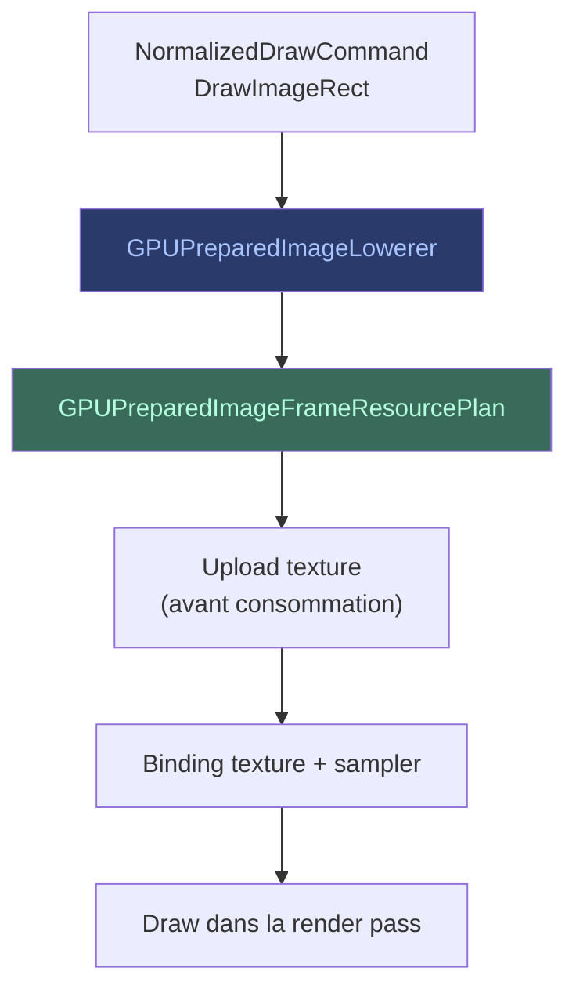
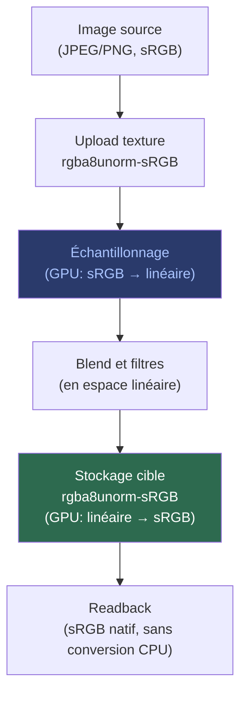

# Opérations Image

Les opérations image (`DrawImageRect`, `DrawImageNine`, `DrawImageLattice`)
permettent de dessiner des images dans le pipeline GPU.

## Flux

## Étapes clés

1. **Normalisation** — le `NormalizedDrawCommand` capture l'image source,
   les bornes, et le filtre d'échantillonnage.
2. **Abaissement** (`GPUPreparedImageLowerer`) — traduit la commande en
   plan de ressources image.
3. **Planification** — le `GPUPreparedImageFrameResourcePlan` réserve les
   slots de texture et sampler.
4. **Upload** — les pixels sont transférés CPU → GPU avant le draw
   consommateur (ordre strict : upload avant sample).
5. **Binding** — la texture et le sampler sont liés au pipeline via le
   layout de binding.
6. **Exécution** — le draw est émis dans la render pass.

## Formats et sRGB

Le pipeline doit gérer correctement l'espace colorimétrique sRGB à
plusieurs étapes : à l'upload des textures source, pendant le rendu,
et au stockage final.

### Pourquoi sRGB est important

Les images destinées à l'affichage (PNG, JPEG) sont encodées en **sRGB** :
les valeurs des pixels ne sont pas linéaires mais suivent une courbe gamma
(~2.2). Si on les traite comme des valeurs linéaires, les calculs de
couleur (blend, filtres) produisent des résultats incorrects — les
dégradés et la transparence paraissent faux.

### Trois formats de texture

Le pipeline distingue trois types de textures selon leur usage :

| Type | Format WebGPU | Usage |
|------|--------------|-------|
| **Source uploadée** | `rgba8unorm` ou `rgba8unorm-srgb` | La texture source est uploadée dans son format natif. Le GPU convertit automatiquement sRGB → linéaire à l'échantillonnage si le format est `-srgb`. |
| **Cible de scène** | `rgba8unorm-srgb` | La texture canonique (`GPUSceneTarget`) est configurée en sRGB. Le GPU convertit automatiquement linéaire → sRGB au stockage. |
| **Intermédiaire** | `rgba8unorm` (linéaire) | Les cibles de calque, snapshots, et textures temporaires restent en espace linéaire pour des calculs corrects. |

### Flux des conversions

### Ce que le pipeline ne fait PAS

- **Pas de conversion CPU.** Le readback retourne les pixels tels quels
  (sRGB si la cible l'est). Aucune conversion logicielle.
- **Pas de double conversion.** Une texture source sRGB uploadée en
  `rgba8unorm-srgb` et échantillonnée par un shader reçoit des valeurs
  linéaires automatiquement. On ne convertit jamais manuellement.
- **Pas de sRGB pour les intermédiaires.** Les snapshots destination et
  les cibles de calque utilisent `rgba8unorm` (linéaire). Les mettre en
  sRGB fausserait le blend.

### Refus explicite

Le pipeline refuse explicitement le format `rgba8unorm-srgb` avec
multisampling (x4). Cette combinaison est déclarée non supportée et
produit un refus typé avant allocation.
