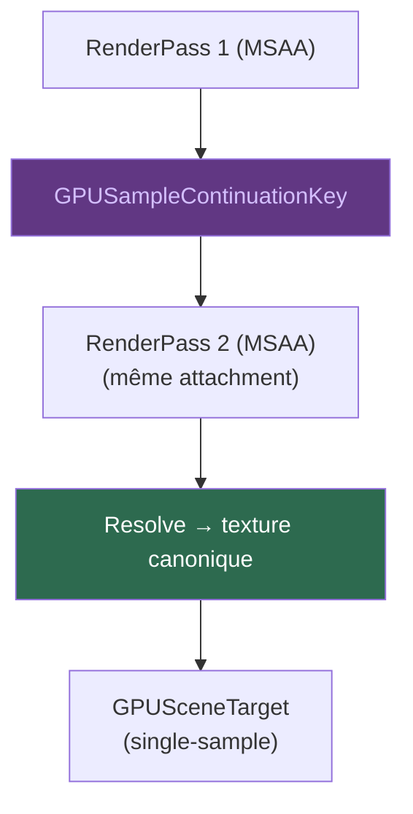

# MSAA — Multi-Sample Anti-Aliasing

Le **MSAA** (Multi-Sample Anti-Aliasing) produit plusieurs échantillons
par pixel pour des bords plus lisses. Le pipeline GPU de Kanvas supporte
le MSAA natif via WebGPU.

## GPUSampleContinuationKey

La **GPUSampleContinuationKey** garantit qu'un même render pass MSAA
conserve son attachment multi-échantillonné d'un draw à l'autre. Une
texture MSAA fraîche n'est jamais acceptée comme continuation — chaque
groupe de passes MSAA possède sa propre clé.

## Store vs Resolve

Chaque passe MSAA doit faire deux choses :

- **Store** — conserver l'attachment multi-échantillonné pour la passe
  suivante (continuation).
- **ResolveCanonical** — réduire les échantillons en un seul pixel dans
  la texture canonique single-sample.

Ces deux opérations sont indépendantes. Une passe peut store sans resolve
(continuation), resolve sans store (dernière passe), ou les deux.

## Contraintes

- Un seul **sample plan** par cible par intervalle de frame actif.
- **MSAA + destination-read** nécessite un `SingleSampleFrame` — tous les
  plans de couverture doivent avoir une preuve de lowering analytique,
  stencil-1x, ou sampled-mask. Sinon, refus avec
  `unsupported.blend.msaa_destination_read_exactness`.
- Le **RetainedTargetAttachment** inter-frame est refusé dans la première
  tranche native. Activé uniquement avec même device/génération et texture
  de resolve autoritaire.
