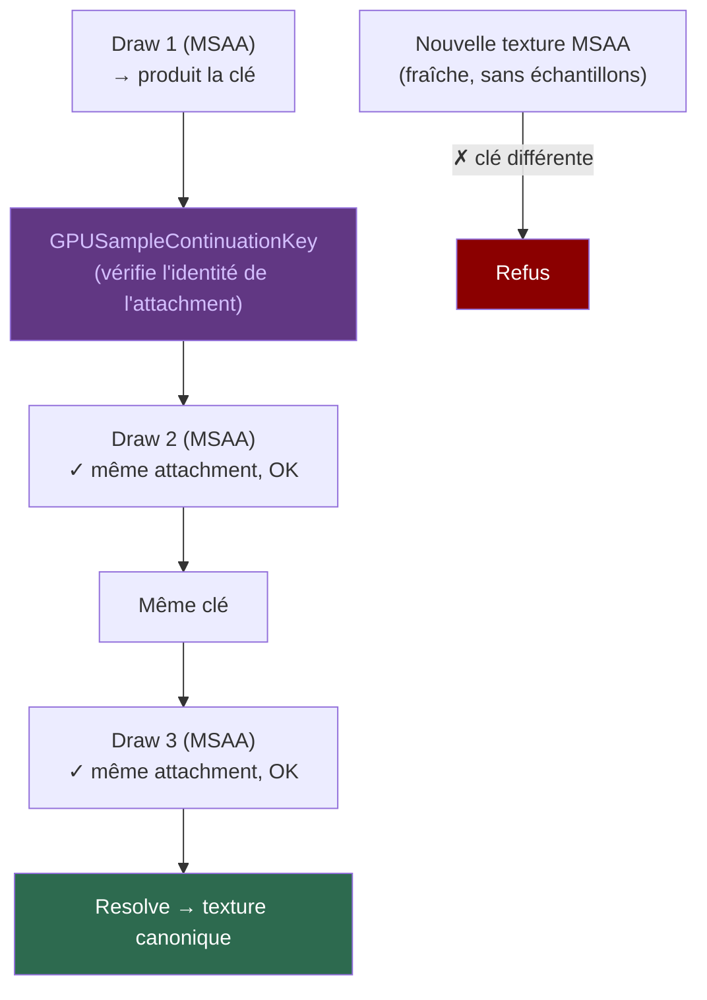

# MSAA — Multi-Sample Anti-Aliasing

Le **MSAA** (Multi-Sample Anti-Aliasing) produit plusieurs échantillons
par pixel pour des bords plus lisses. Le pipeline GPU de Kanvas supporte
le MSAA natif via WebGPU.

## GPUSampleContinuationKey

Quand on dessine plusieurs formes dans un même render pass MSAA, chaque
draw s'accumule dans l'attachment multi-échantillonné. Pour que le
deuxième draw « voie » les échantillons du premier (et que
l'anti-aliasing fonctionne), il faut que ce soit **exactement la même
texture MSAA** qui serve d'attachment d'un draw à l'autre.

La **GPUSampleContinuationKey** est la clé qui garantit cette identité.
Elle est produite au premier draw MSAA et vérifiée à chaque draw suivant.
Si un draw essaie d'utiliser une nouvelle texture MSAA (une texture
fraîchement allouée, qui ne contient pas les échantillons des draws
précédents), la clé ne correspond pas et le plan est refusé.

En pratique, cela signifie qu'un render pass MSAA utilise **une seule
texture multi-échantillonnée** pour tous ses draws. On ne peut pas
changer d'attachment MSAA au milieu d'une passe. Si on doit changer
(par exemple pour un calque intermédiaire), on termine la passe, on
resolve, et on en commence une nouvelle.

## Store vs Resolve

Chaque passe MSAA doit faire deux choses :

- **Store** — conserver l'attachment multi-échantillonné pour la passe
  suivante (continuation).
- **ResolveCanonical** — réduire les échantillons en un seul pixel dans
  la texture canonique single-sample.

Ces deux opérations sont indépendantes. Une passe peut store sans resolve
(continuation), resolve sans store (dernière passe), ou les deux.

## Contraintes

- Un seul **sample plan** par cible par intervalle de frame actif.
- **MSAA + destination-read** nécessite un `SingleSampleFrame` — tous les
  plans de couverture doivent avoir une preuve de lowering analytique,
  stencil-1x, ou sampled-mask. Sinon, refus avec
  `unsupported.blend.msaa_destination_read_exactness`.
- Le **RetainedTargetAttachment** inter-frame est refusé dans la première
  tranche native. Activé uniquement avec même device/génération et texture
  de resolve autoritaire.
