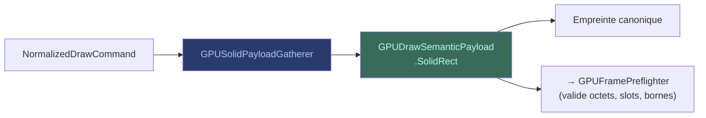

# Payloads de dessin

Les **payloads** sont les données concrètes que le GPU reçoit pour exécuter
un draw. Elles sont produites par le pipeline d'analyse et consommées par
le pré-vol.

## GPUSolidPayloadGatherer

Le **GPUSolidPayloadGatherer** rassemble les données d'un draw solide
(couleur unie, rectangle plein) et les empaquette dans un format binaire
optimisé pour le GPU. Il capture les champs, les slots, et les empreintes.

## GPUDrawSemanticPayload

Le **GPUDrawSemanticPayload** est le conteneur immuable qui transporte
les données de draw à travers le pipeline. Sa première variante est
`SolidRect` — elle capture les octets, champs, slots et empreintes d'un
rectangle plein.

## Propriétés

- **Profondément immuable** — une fois produit, le payload ne change plus.
- **Algèbre fermée** — chaque variante (SolidRect, puis d'autres) est un
  type scellé.
- **Empreinte canonique** — deux plans avec des labels identiques mais des
  payloads différents sont des plans différents.
- **Validé au pré-vol** — le `GPUFramePreflighter` vérifie les octets
  attendus, les slots et les bornes avant la soumission.

## Contrat

Un payload absent ou invalide produit un refus typé avant soumission —
aucun token natif n'est enregistré, aucun encoder n'est créé.
