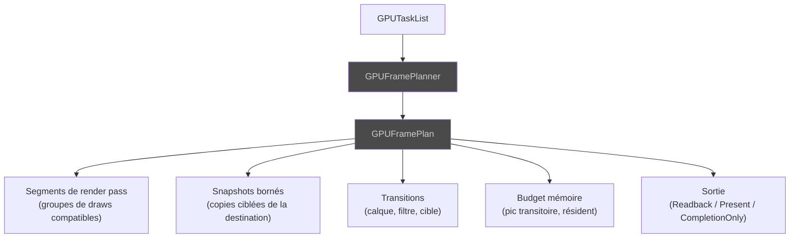

# Planification — GPUFramePlanner, GPUFramePlan

Le **GPUFramePlanner** consomme le `GPUTaskList` et produit un
**GPUFramePlan** — un plan d'exécution linéaire, ordonné, immuable, et
**sans aucune ressource GPU native**.

## Contenu du plan

## GPUFrameCoordinator

Le **GPUFrameCoordinator** est le point d'entrée unique vers la
planification, le pré-vol et l'exécution. Aucun code externe ne peut
court-circuiter ce chemin. Il préserve les refus comme des résultats
terminaux.

> Voir [Concepts — Frame Plan](../concepts/frame-plan.md) pour la
> comparaison plan linéaire vs DAG.
