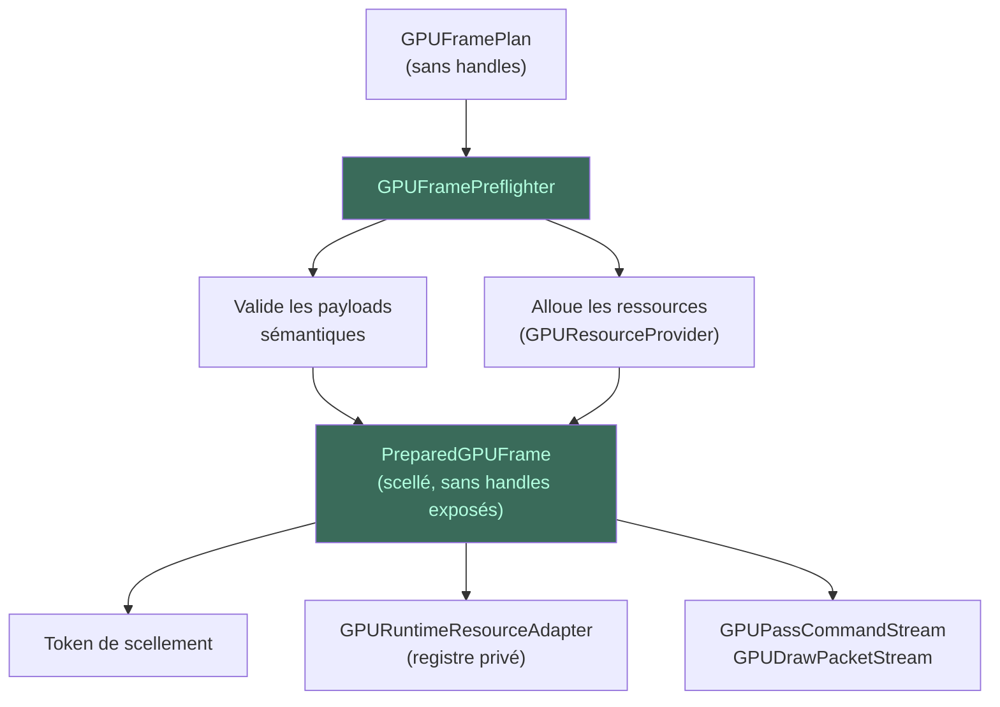

# Pré-vol — GPUFramePreflighter, PreparedGPUFrame

Le **GPUFramePreflighter** est la **seule frontière de matérialisation**
du pipeline. C'est le premier (et unique) composant qui crée des
ressources GPU concrètes.

## Flux

## Pourquoi cette séparation ?

- **Correction :** le plan est figé avant toute allocation GPU.
- **Diagnostic :** le plan peut être inspecté sans toucher au GPU.
- **Sécurité :** pas de fuite de handles natifs hors du PreparedGPUFrame.
- **Testabilité :** plan (sans GPU) et pré-vol (avec GPU) testés séparément.

## Gestion des erreurs

- **Échec au pré-vol :** rollback atomique de toutes les ressources.
- **Succès :** PreparedGPUFrame scellé, prêt pour l'exécution.

> Voir [Concepts — Pré-vol & Exécution](../concepts/pre-vol-execution.md)
> pour le détail du flux complet.
