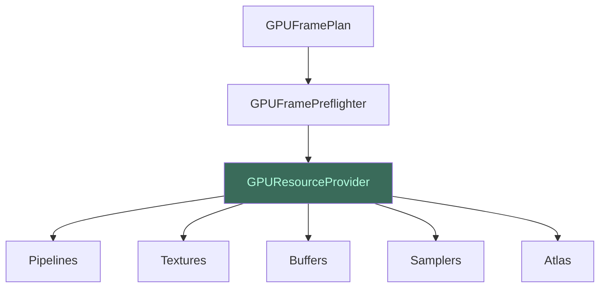

# Ressources GPU

La couche **ressources** est responsable de l'allocation, du partage et
du cycle de vie de toutes les ressources GPU concrètes : textures, buffers,
pipelines, samplers.

## GPUResourceProvider

Le **GPUResourceProvider** est le propriétaire unique des ressources GPU.
Il expose des méthodes d'allocation typées et maintient un registre
d'identité. Les ressources ne sont matérialisées qu'au moment du pré-vol
— jamais avant.

## GPUScratchTexturePool

Le **GPUScratchTexturePool** gère les textures temporaires. Il les indexe
par format, usage, sample count et classe de taille. Les textures sont
réutilisées entre frames uniquement si leur lease précédent est complété
et non chevauchant.

| Critère de réutilisation | Description |
|--------------------------|-------------|
| Format identique | Même format de pixel |
| Usage compatible | Mêmes flags d'usage |
| Sample count identique | Même nombre d'échantillons |
| Classe de taille | Même palier de dimensions |
| Lease complété | La frame précédente a terminé |

## GPUFrameMemoryBudget

Le **GPUFrameMemoryBudget** comptabilise la mémoire utilisée par une
frame :

- **Octets transitoires pic** (`peakFrameTransientBytes`) — le maximum
  de mémoire temporaire allouée à un instant donné.
- **Octets résidents cible** (`targetResidentBytes`) — la mémoire occupée
  par la texture canonique et les caches persistants.

Chaque snapshot destination, chaque cible de calque, chaque buffer de
staging est comptabilisé. Le budget permet de refuser une frame avant
allocation si elle dépasserait les capacités du device.
