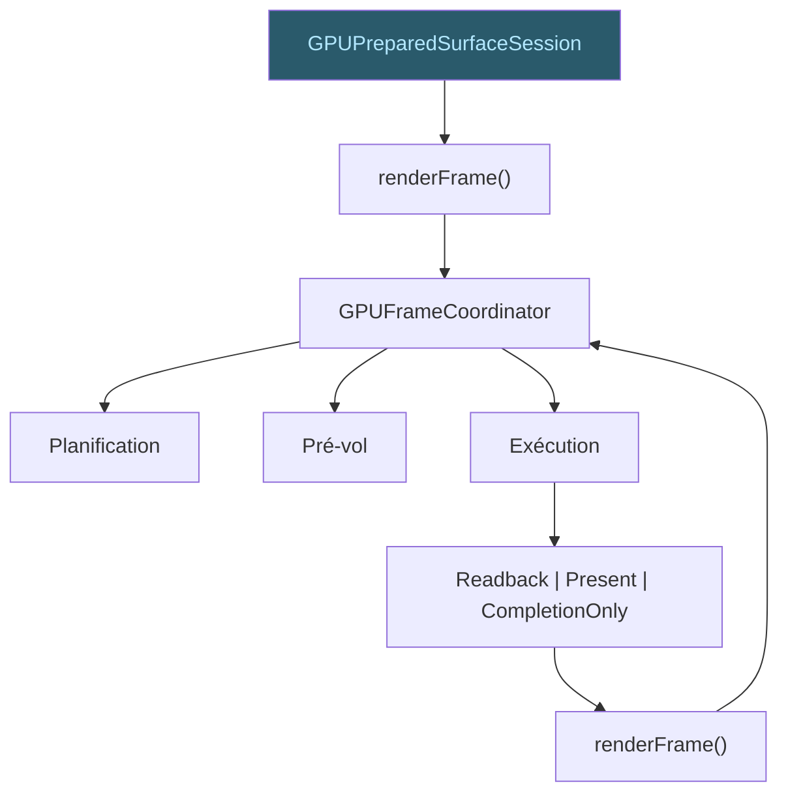

# Session Surface réutilisable

La **GPUPreparedSurfaceSession** encapsule l'état réutilisable entre
frames successives d'une même Surface.

## État partagé

- Device WebGPU et ses capacités (`GPUCapabilities`)
- Cible canonique (`GPUSceneTarget`)
- Génération du device
- Caches réutilisables (pipelines invariants, pools)
- Compteurs de création/réutilisation

## Cycle de frame

Chaque `renderFrame()` crée un coordinateur frame-local frais. La session
retient le backend et les caches entre appels.

La session est conçue pour supporter des frames répétées sans
réouverture du backend. Le device, la cible canonique, la génération
et les caches survivent entre appels à `renderFrame()`. Chaque appel
crée un coordinateur frame-local frais, qui enchaîne planification,
pré-vol et exécution.
