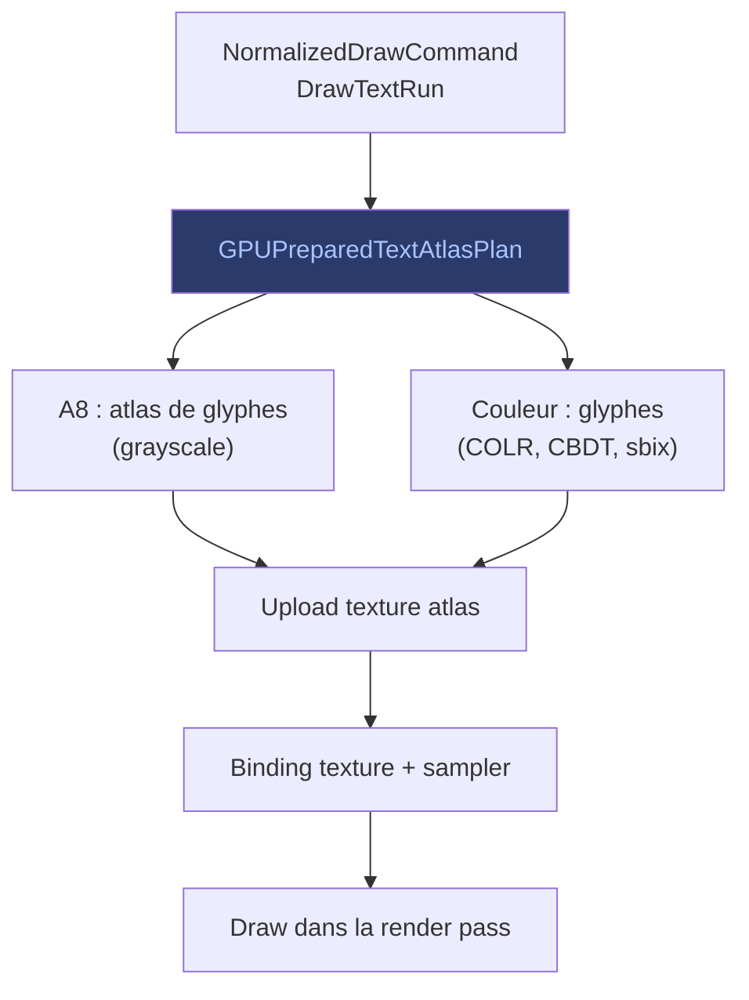

# Opérations Texte

Les opérations texte (`DrawTextRun`) gèrent le rendu de glyphes :
masques A8 (niveaux de gris) et glyphes couleur (COLRv0/v1, CBDT, sbix).

## Flux

## A8 (Alpha-only)

Les glyphes A8 sont rasterisés côté CPU en niveaux de gris, stockés dans
un atlas de texture, puis uploadés. Le shader utilise la valeur alpha du
glyphe comme masque pour la couleur de peinture.

## Glyphes couleur

Les glyphes couleur (COLRv0/v1, CBDT, sbix) sont des images RGBA
directement utilisables. Ils suivent un chemin similaire aux opérations
image mais avec une gestion spécifique de l'atlas de glyphes.

> Voir [Images](images.md) pour les étapes d'upload et binding.
