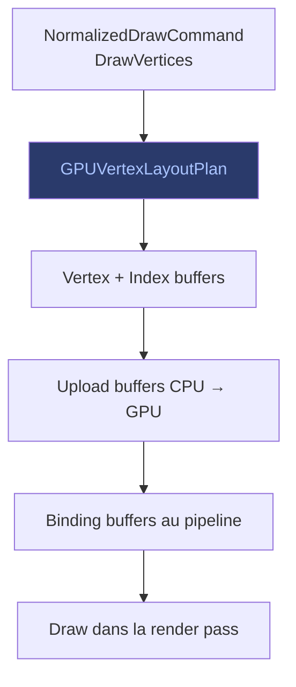

# Opérations Vertices

Les opérations vertices (`DrawVertices`) permettent de dessiner des
maillages de triangles avec des coordonnées, couleurs et textures
spécifiées par l'utilisateur.

## Flux

## Autorité de blend

Les vertices utilisent la même autorité de blend que les autres
opérations (`GPUBlendPlan`). Les buffers de vertices et d'index sont
préparés et uploadés avant consommation, comme les textures.

> Voir [Blend & Couleur](blend-couleur.md) pour l'autorité de blend.
