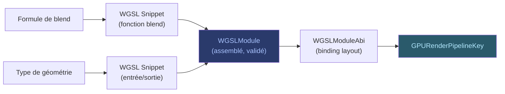

# WGSL — Shaders et Pipelines

La couche **WGSL** assemble, valide et spécialise les shaders qui seront
exécutés sur le GPU.

## WGSLModule et WGSLFragment

Un **WGSLModule** est un shader complet, assemblé à partir de snippets
et validé par wgsl4k. Un **WGSLFragment** est une portion de shader
(fonction d'entrée, calcul de couleur) qui sera composée avec d'autres
fragments pour former un module complet.

## GPURenderPipelineKey

La **GPURenderPipelineKey** identifie de manière unique un pipeline de
rendu. Elle contient :

- L'identité de la **formule de blend** (quel mode, quel shader)
- La **topologie de binding** (quelles ressources sont liées)
- L'**état d'attachment** exact (format, sample count)
- Le **format cible** et la classe de couleur
- La **spécialisation d'opacité** source
- La **topologie de couverture** (scalar, stencil, MSAA)

La clé **exclut** volontairement l'identité de texture concrète, l'origine
du snapshot, et les bornes logiques — ce qui permet le partage de pipelines
entre draws compatibles.

## WGSLBindingLayout et WGSLPackingPlan

Le **WGSLBindingLayout** décrit comment les ressources (uniforms, textures,
samplers) sont exposées au shader. Le **WGSLPackingPlan** organise les
données dans les buffers uniformes pour respecter les contraintes
d'alignement du device.

> Voir [Payloads](payloads.md) pour la liaison entre les données de draw
> et les bindings WGSL.
