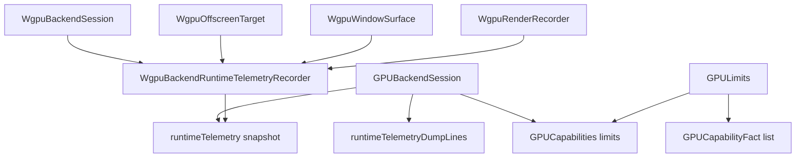

# GPU Baseline Caps Implementation Plan

> **For agentic workers:** REQUIRED SUB-SKILL: Use superpowers:subagent-driven-development (recommended) or superpowers:executing-plans to implement this plan task-by-task. Steps use checkbox (`- [ ]`) syntax for tracking.

**Goal:** Build the first GPU refactor slice: passive runtime telemetry plus minimal GPU limits exposed through the existing backend session contracts.

**Architecture:** Extend the existing public contracts instead of adding a parallel backend layer. `GPUBackendSession` exposes snapshots; the concrete runtime records counters passively; capability limits stay explicit and convertible to deterministic capability facts.

**Tech Stack:** Kotlin/JVM, Gradle, kotlin.test, wgpu4k/WebGPU runtime bridge, existing `gpu-renderer` module.

---

## File Structure

- Modify `gpu-renderer/src/main/kotlin/org/graphiks/kanvas/gpu/renderer/execution/GPUBackendRuntimeContracts.kt`
  - Add `GPUBackendRuntimeTelemetry`.
  - Add default `GPUBackendSession.runtimeTelemetry`, `runtimeTelemetryDumpLines`, and `capabilities`.
- Modify `gpu-renderer/src/test/kotlin/org/graphiks/kanvas/gpu/renderer/execution/GPUBackendRuntimeContractsTest.kt`
  - Cover zero counters, negative counter rejection, deterministic dump lines, and session defaults.
- Modify `gpu-renderer/src/main/kotlin/org/graphiks/kanvas/gpu/renderer/capabilities/CapabilityContracts.kt`
  - Add `GPULimits`.
  - Add optional `GPUCapabilities.limits` with a default value.
- Create `gpu-renderer/src/test/kotlin/org/graphiks/kanvas/gpu/renderer/capabilities/GPUCapabilityContractsTest.kt`
  - Cover limit validation and stable conversion to `GPUCapabilityFact`.
- Modify `gpu-renderer/src/main/kotlin/org/graphiks/kanvas/gpu/renderer/execution/GPUBackendRuntimeWgpu.kt`
  - Add a private telemetry recorder.
  - Wire session capabilities from conservative runtime constants.
  - Inject telemetry into offscreen targets, window surfaces, and render recorders.
  - Increment counters at existing centralized encode, submit, create, and queue-write points.
- Modify `gpu-renderer/src/test/kotlin/org/graphiks/kanvas/gpu/renderer/execution/GPUBackendRuntimeWgpuSmokeTest.kt`
  - Add smoke assertions for capabilities and runtime telemetry deltas.

## Design Rules For This Slice

- Keep public wording as `GPU`, not `Wgpu`.
- Do not change rendering decisions, shader code, pipeline keys, cache semantics, or GM references.
- Treat telemetry as observational state only.
- Test counter deltas or lower bounds in smoke tests because the shared backend session can accumulate previous work.
- Never expose backend handles, object identities, or raw native pointers in dump lines.

### Task 1: Add Runtime Telemetry Contract

**Files:**
- Modify: `gpu-renderer/src/main/kotlin/org/graphiks/kanvas/gpu/renderer/execution/GPUBackendRuntimeContracts.kt:3-81`
- Modify: `gpu-renderer/src/test/kotlin/org/graphiks/kanvas/gpu/renderer/execution/GPUBackendRuntimeContractsTest.kt:1-160`

- [ ] **Step 1: Write failing contract tests**

Add `assertTrue` to the existing imports in `GPUBackendRuntimeContractsTest.kt`:

```kotlin
import kotlin.test.assertTrue
```

Add these tests inside `class GPUBackendRuntimeContractsTest`, before `private fun payloadMaterialization`:

```kotlin
    @Test
    fun `runtime telemetry defaults to zero counters and deterministic dump`() {
        val telemetry = GPUBackendRuntimeTelemetry()

        assertEquals(0L, telemetry.renderPasses)
        assertEquals(0L, telemetry.offscreenPasses)
        assertEquals(0L, telemetry.windowPasses)
        assertEquals(0L, telemetry.submissions)
        assertEquals(0L, telemetry.buffersCreated)
        assertEquals(0L, telemetry.texturesCreated)
        assertEquals(0L, telemetry.bindGroupsCreated)
        assertEquals(0L, telemetry.samplersCreated)
        assertEquals(0L, telemetry.queueWrites)
        assertEquals(
            listOf(
                "gpu-runtime.telemetry renderPasses=0 offscreenPasses=0 windowPasses=0 " +
                    "submissions=0 buffersCreated=0 texturesCreated=0 bindGroupsCreated=0 " +
                    "samplersCreated=0 queueWrites=0",
            ),
            telemetry.dumpLines(),
        )
        assertTrue(!telemetry.dumpLines().joinToString("\n").contains("@"))
    }

    @Test
    fun `runtime telemetry rejects negative counters`() {
        assertFailsWith<IllegalArgumentException> {
            GPUBackendRuntimeTelemetry(renderPasses = -1L)
        }
        assertFailsWith<IllegalArgumentException> {
            GPUBackendRuntimeTelemetry(queueWrites = -1L)
        }
    }

    @Test
    fun `backend session defaults expose empty telemetry and no capabilities`() {
        val session = NoopBackendSession()

        assertEquals(GPUBackendRuntimeTelemetry.Empty, session.runtimeTelemetry)
        assertEquals(GPUBackendRuntimeTelemetry.Empty.dumpLines(), session.runtimeTelemetryDumpLines)
        assertEquals(null, session.capabilities)
    }
```

Add this helper class at the bottom of `GPUBackendRuntimeContractsTest.kt`, inside `class GPUBackendRuntimeContractsTest`:

```kotlin
    private class NoopBackendSession : GPUBackendSession {
        override val adapterInfo: GPUBackendAdapterSummary? = null

        override fun createOffscreenTarget(request: GPUOffscreenTargetRequest): GPUBackendOffscreenTarget =
            error("NoopBackendSession cannot create offscreen targets")

        override fun createWindowSurface(binding: GPUNativeSurfaceBinding): GPUBackendWindowSurface =
            error("NoopBackendSession cannot create window surfaces")

        override fun close() = Unit
    }
```

- [ ] **Step 2: Run the focused test and verify it fails**

Run:

```bash
rtk ./gradlew --no-daemon :gpu-renderer:test --tests org.graphiks.kanvas.gpu.renderer.execution.GPUBackendRuntimeContractsTest
```

Expected: FAIL with unresolved references for `GPUBackendRuntimeTelemetry`, `runtimeTelemetry`, `runtimeTelemetryDumpLines`, and `capabilities`.

- [ ] **Step 3: Add the telemetry contract and session defaults**

Add this import to `GPUBackendRuntimeContracts.kt`:

```kotlin
import org.graphiks.kanvas.gpu.renderer.capabilities.GPUCapabilities
```

Insert this data class after `GPUBackendAdapterSummary`:

```kotlin
/** Aggregated passive counters for a GPU backend session. */
data class GPUBackendRuntimeTelemetry(
    val renderPasses: Long = 0L,
    val offscreenPasses: Long = 0L,
    val windowPasses: Long = 0L,
    val submissions: Long = 0L,
    val buffersCreated: Long = 0L,
    val texturesCreated: Long = 0L,
    val bindGroupsCreated: Long = 0L,
    val samplersCreated: Long = 0L,
    val queueWrites: Long = 0L,
) {
    init {
        require(renderPasses >= 0L) { "GPUBackendRuntimeTelemetry.renderPasses must be non-negative" }
        require(offscreenPasses >= 0L) { "GPUBackendRuntimeTelemetry.offscreenPasses must be non-negative" }
        require(windowPasses >= 0L) { "GPUBackendRuntimeTelemetry.windowPasses must be non-negative" }
        require(submissions >= 0L) { "GPUBackendRuntimeTelemetry.submissions must be non-negative" }
        require(buffersCreated >= 0L) { "GPUBackendRuntimeTelemetry.buffersCreated must be non-negative" }
        require(texturesCreated >= 0L) { "GPUBackendRuntimeTelemetry.texturesCreated must be non-negative" }
        require(bindGroupsCreated >= 0L) { "GPUBackendRuntimeTelemetry.bindGroupsCreated must be non-negative" }
        require(samplersCreated >= 0L) { "GPUBackendRuntimeTelemetry.samplersCreated must be non-negative" }
        require(queueWrites >= 0L) { "GPUBackendRuntimeTelemetry.queueWrites must be non-negative" }
    }

    /** Deterministic diagnostic lines without backend object identities. */
    fun dumpLines(): List<String> =
        listOf(
            "gpu-runtime.telemetry renderPasses=$renderPasses offscreenPasses=$offscreenPasses " +
                "windowPasses=$windowPasses submissions=$submissions buffersCreated=$buffersCreated " +
                "texturesCreated=$texturesCreated bindGroupsCreated=$bindGroupsCreated " +
                "samplersCreated=$samplersCreated queueWrites=$queueWrites",
        )

    companion object {
        val Empty = GPUBackendRuntimeTelemetry()
    }
}
```

Add these properties to `GPUBackendSession` after `val adapterInfo`:

```kotlin
    /** Reports the backend implementation and behavior-affecting limits when known. */
    val capabilities: GPUCapabilities?
        get() = null

    /** Reports passive runtime counters emitted by this session. */
    val runtimeTelemetry: GPUBackendRuntimeTelemetry
        get() = GPUBackendRuntimeTelemetry.Empty

    /** Reports deterministic runtime telemetry dump lines without backend handles. */
    val runtimeTelemetryDumpLines: List<String>
        get() = runtimeTelemetry.dumpLines()
```

- [ ] **Step 4: Run the focused test and verify it passes**

Run:

```bash
rtk ./gradlew --no-daemon :gpu-renderer:test --tests org.graphiks.kanvas.gpu.renderer.execution.GPUBackendRuntimeContractsTest
```

Expected: PASS.

- [ ] **Step 5: Commit Task 1**

Run:

```bash
git add gpu-renderer/src/main/kotlin/org/graphiks/kanvas/gpu/renderer/execution/GPUBackendRuntimeContracts.kt \
    gpu-renderer/src/test/kotlin/org/graphiks/kanvas/gpu/renderer/execution/GPUBackendRuntimeContractsTest.kt
git commit -m "Add GPU backend runtime telemetry contract"
```

### Task 2: Add GPU Limits Contract

**Files:**
- Modify: `gpu-renderer/src/main/kotlin/org/graphiks/kanvas/gpu/renderer/capabilities/CapabilityContracts.kt:1-54`
- Create: `gpu-renderer/src/test/kotlin/org/graphiks/kanvas/gpu/renderer/capabilities/GPUCapabilityContractsTest.kt`

- [ ] **Step 1: Write failing capability tests**

Create `gpu-renderer/src/test/kotlin/org/graphiks/kanvas/gpu/renderer/capabilities/GPUCapabilityContractsTest.kt`:

```kotlin
package org.graphiks.kanvas.gpu.renderer.capabilities

import kotlin.test.Test
import kotlin.test.assertEquals
import kotlin.test.assertFailsWith
import kotlin.test.assertTrue

class GPUCapabilityContractsTest {
    @Test
    fun `GPU limits validate positive values and nonblank source`() {
        val limits = GPULimits(
            maxTextureDimension2D = 8192L,
            copyBytesPerRowAlignment = 256L,
            minUniformBufferOffsetAlignment = 256L,
            source = "device.limits",
        )

        assertEquals(8192L, limits.maxTextureDimension2D)
        assertEquals(256L, limits.copyBytesPerRowAlignment)
        assertEquals(256L, limits.minUniformBufferOffsetAlignment)
        assertEquals("device.limits", limits.source)
        assertFailsWith<IllegalArgumentException> {
            GPULimits(
                maxTextureDimension2D = 0L,
                copyBytesPerRowAlignment = 256L,
                minUniformBufferOffsetAlignment = 256L,
                source = "device.limits",
            )
        }
        assertFailsWith<IllegalArgumentException> {
            GPULimits(
                maxTextureDimension2D = 8192L,
                copyBytesPerRowAlignment = 0L,
                minUniformBufferOffsetAlignment = 256L,
                source = "device.limits",
            )
        }
        assertFailsWith<IllegalArgumentException> {
            GPULimits(
                maxTextureDimension2D = 8192L,
                copyBytesPerRowAlignment = 256L,
                minUniformBufferOffsetAlignment = 0L,
                source = "device.limits",
            )
        }
        assertFailsWith<IllegalArgumentException> {
            GPULimits(
                maxTextureDimension2D = 8192L,
                copyBytesPerRowAlignment = 256L,
                minUniformBufferOffsetAlignment = 256L,
                source = "",
            )
        }
    }

    @Test
    fun `GPU limits expose stable capability facts`() {
        val facts = GPULimits(
            maxTextureDimension2D = 8192L,
            copyBytesPerRowAlignment = 256L,
            minUniformBufferOffsetAlignment = 256L,
            source = "runtime.conservative",
        ).capabilityFacts(evidenceLabel = "runtime")

        assertEquals(
            listOf(
                "maxTextureDimension2D",
                "copyBytesPerRowAlignment",
                "minUniformBufferOffsetAlignment",
            ),
            facts.map { it.name },
        )
        assertEquals(listOf("8192", "256", "256"), facts.map { it.value })
        assertEquals(setOf("runtime.conservative"), facts.map { it.source }.toSet())
        assertTrue(facts.all { it.affectsValidity })
        assertTrue(facts.all { it.evidenceLabel == "runtime" })
        assertTrue(!facts.joinToString("\n").contains("@"))
    }

    @Test
    fun `GPU capabilities can carry limits without forcing existing facts`() {
        val limits = GPULimits.conservative(
            maxTextureDimension2D = 8192L,
            copyBytesPerRowAlignment = 256L,
            minUniformBufferOffsetAlignment = 256L,
        )
        val capabilities = GPUCapabilities(
            implementation = GPUImplementationIdentity(
                facadeName = "GPU",
                implementationName = "unit",
                adapterName = "unit-adapter",
                deviceName = "unit-device",
            ),
            facts = emptyList(),
            snapshotId = "unit-snapshot",
            limits = limits,
        )

        assertEquals(limits, capabilities.limits)
        assertEquals(emptyList(), capabilities.facts)
        assertEquals("runtime.conservative", capabilities.limits?.source)
    }
}
```

- [ ] **Step 2: Run the focused test and verify it fails**

Run:

```bash
rtk ./gradlew --no-daemon :gpu-renderer:test --tests org.graphiks.kanvas.gpu.renderer.capabilities.GPUCapabilityContractsTest
```

Expected: FAIL with unresolved reference `GPULimits` and constructor parameter `limits`.

- [ ] **Step 3: Add `GPULimits` and extend `GPUCapabilities`**

Insert this data class after `GPULimitRequirement` in `CapabilityContracts.kt`:

```kotlin
/** Adapter/device limits that affect backend route validity and resource planning. */
data class GPULimits(
    val maxTextureDimension2D: Long,
    val copyBytesPerRowAlignment: Long,
    val minUniformBufferOffsetAlignment: Long,
    val source: String = "device.limits",
) {
    init {
        require(maxTextureDimension2D > 0L) { "GPULimits.maxTextureDimension2D must be positive" }
        require(copyBytesPerRowAlignment > 0L) { "GPULimits.copyBytesPerRowAlignment must be positive" }
        require(minUniformBufferOffsetAlignment > 0L) {
            "GPULimits.minUniformBufferOffsetAlignment must be positive"
        }
        require(source.isNotBlank()) { "GPULimits.source must not be blank" }
    }

    fun capabilityFacts(evidenceLabel: String): List<GPUCapabilityFact> {
        require(evidenceLabel.isNotBlank()) { "evidenceLabel must not be blank" }
        return listOf(
            GPUCapabilityFact(
                name = "maxTextureDimension2D",
                source = source,
                value = maxTextureDimension2D.toString(),
                affectsValidity = true,
                evidenceLabel = evidenceLabel,
            ),
            GPUCapabilityFact(
                name = "copyBytesPerRowAlignment",
                source = source,
                value = copyBytesPerRowAlignment.toString(),
                affectsValidity = true,
                evidenceLabel = evidenceLabel,
            ),
            GPUCapabilityFact(
                name = "minUniformBufferOffsetAlignment",
                source = source,
                value = minUniformBufferOffsetAlignment.toString(),
                affectsValidity = true,
                evidenceLabel = evidenceLabel,
            ),
        )
    }

    companion object {
        fun conservative(
            maxTextureDimension2D: Long,
            copyBytesPerRowAlignment: Long,
            minUniformBufferOffsetAlignment: Long,
        ): GPULimits =
            GPULimits(
                maxTextureDimension2D = maxTextureDimension2D,
                copyBytesPerRowAlignment = copyBytesPerRowAlignment,
                minUniformBufferOffsetAlignment = minUniformBufferOffsetAlignment,
                source = "runtime.conservative",
            )
    }
}
```

Change `GPUCapabilities` to include the optional limits field at the end:

```kotlin
/** Capability snapshot for the selected GPU facade implementation. */
data class GPUCapabilities(
    val implementation: GPUImplementationIdentity,
    val facts: List<GPUCapabilityFact>,
    val knownUnsupportedFacts: List<GPUCapabilityFact> = emptyList(),
    val snapshotId: String,
    val limits: GPULimits? = null,
)
```

- [ ] **Step 4: Run capability tests and existing capability call sites**

Run:

```bash
rtk ./gradlew --no-daemon :gpu-renderer:test --tests org.graphiks.kanvas.gpu.renderer.capabilities.GPUCapabilityContractsTest
rtk ./gradlew --no-daemon :gpu-renderer:test --tests org.graphiks.kanvas.gpu.renderer.analysis.FirstRoutePlannerTest
rtk ./gradlew --no-daemon :gpu-renderer:test --tests org.graphiks.kanvas.gpu.renderer.product.ProductFlagsM18Test --tests org.graphiks.kanvas.gpu.renderer.product.ProductFlagsM19Test
```

Expected: PASS for all three commands.

- [ ] **Step 5: Commit Task 2**

Run:

```bash
git add gpu-renderer/src/main/kotlin/org/graphiks/kanvas/gpu/renderer/capabilities/CapabilityContracts.kt \
    gpu-renderer/src/test/kotlin/org/graphiks/kanvas/gpu/renderer/capabilities/GPUCapabilityContractsTest.kt
git commit -m "Add GPU backend limits contract"
```

### Task 3: Wire Session Capabilities And Telemetry Recorder

**Files:**
- Modify: `gpu-renderer/src/main/kotlin/org/graphiks/kanvas/gpu/renderer/execution/GPUBackendRuntimeWgpu.kt:1-289`
- Modify: `gpu-renderer/src/test/kotlin/org/graphiks/kanvas/gpu/renderer/execution/GPUBackendRuntimeWgpuSmokeTest.kt:1-114`

- [ ] **Step 1: Write failing smoke test for runtime capabilities**

Add this test to `GPUBackendRuntimeWgpuSmokeTest.kt` after `offscreen target helper derives deterministic unique target id per session and target`:

```kotlin
    @Test
    fun `backend runtime exposes conservative GPU capabilities when backend is available`() {
        val runtime = GPUBackendRuntimeFactory.createOrNull()
        assumeTrue(runtime != null, "GPU backend unavailable in current environment")

        runtime!!.use { session ->
            val capabilities = session.capabilities
                ?: error("GPU backend session should expose capabilities")
            val limits = capabilities.limits
                ?: error("GPU backend session should expose limits")
            val facts = limits.capabilityFacts(evidenceLabel = "runtime")

            assertEquals("GPU", capabilities.implementation.facadeName)
            assertEquals("wgpu4k", capabilities.implementation.implementationName)
            assertEquals(8192L, limits.maxTextureDimension2D)
            assertEquals(256L, limits.copyBytesPerRowAlignment)
            assertEquals(256L, limits.minUniformBufferOffsetAlignment)
            assertEquals("runtime.conservative", limits.source)
            assertEquals(
                listOf("maxTextureDimension2D", "copyBytesPerRowAlignment", "minUniformBufferOffsetAlignment"),
                facts.map { it.name },
            )
            assertTrue(!facts.joinToString("\n").contains("@"))
        }
    }
```

- [ ] **Step 2: Run the focused smoke test and verify it fails**

Run:

```bash
rtk ./gradlew --no-daemon :gpu-renderer:test --tests org.graphiks.kanvas.gpu.renderer.execution.GPUBackendRuntimeWgpuSmokeTest.backend\\ runtime\\ exposes\\ conservative\\ GPU\\ capabilities\\ when\\ backend\\ is\\ available
```

Expected: FAIL when the backend is available because `session.capabilities` is null. If the backend is unavailable, the test is skipped by `assumeTrue`.

- [ ] **Step 3: Add imports, constants, and a private telemetry recorder**

Add these imports to `GPUBackendRuntimeWgpu.kt`:

```kotlin
import org.graphiks.kanvas.gpu.renderer.capabilities.GPUCapabilities
import org.graphiks.kanvas.gpu.renderer.capabilities.GPUImplementationIdentity
import org.graphiks.kanvas.gpu.renderer.capabilities.GPULimits
```

Add this constant after `MAX_TEXTURE_DIMENSION`:

```kotlin
private const val MIN_UNIFORM_BUFFER_OFFSET_ALIGNMENT: Int = 256
```

Insert this private recorder before `private class WgpuBackendSession`:

```kotlin
private class WgpuBackendRuntimeTelemetryRecorder {
    private var renderPasses = 0L
    private var offscreenPasses = 0L
    private var windowPasses = 0L
    private var submissions = 0L
    private var buffersCreated = 0L
    private var texturesCreated = 0L
    private var bindGroupsCreated = 0L
    private var samplersCreated = 0L
    private var queueWrites = 0L

    fun recordOffscreenRenderPass() {
        renderPasses += 1L
        offscreenPasses += 1L
    }

    fun recordWindowRenderPass() {
        renderPasses += 1L
        windowPasses += 1L
    }

    fun recordSubmission() {
        submissions += 1L
    }

    fun recordBufferCreated() {
        buffersCreated += 1L
    }

    fun recordTextureCreated() {
        texturesCreated += 1L
    }

    fun recordBindGroupCreated() {
        bindGroupsCreated += 1L
    }

    fun recordSamplerCreated() {
        samplersCreated += 1L
    }

    fun recordQueueWrite() {
        queueWrites += 1L
    }

    fun snapshot(): GPUBackendRuntimeTelemetry =
        GPUBackendRuntimeTelemetry(
            renderPasses = renderPasses,
            offscreenPasses = offscreenPasses,
            windowPasses = windowPasses,
            submissions = submissions,
            buffersCreated = buffersCreated,
            texturesCreated = texturesCreated,
            bindGroupsCreated = bindGroupsCreated,
            samplersCreated = samplersCreated,
            queueWrites = queueWrites,
        )
}
```

- [ ] **Step 4: Expose session capabilities and telemetry snapshots**

In `WgpuBackendSession`, add these properties after `executionCaches`:

```kotlin
    private val telemetryRecorder = WgpuBackendRuntimeTelemetryRecorder()
    private val backendLimits = GPULimits.conservative(
        maxTextureDimension2D = MAX_TEXTURE_DIMENSION.toLong(),
        copyBytesPerRowAlignment = COPY_BYTES_PER_ROW_ALIGNMENT.toLong(),
        minUniformBufferOffsetAlignment = MIN_UNIFORM_BUFFER_OFFSET_ALIGNMENT.toLong(),
    )
```

Add these overrides after `adapterInfo`:

```kotlin
    override val capabilities: GPUCapabilities =
        GPUCapabilities(
            implementation = GPUImplementationIdentity(
                facadeName = "GPU",
                implementationName = "wgpu4k",
                adapterName = adapterInfo?.summary ?: "unknown-adapter",
                deviceName = adapterInfo?.summary ?: "unknown-device",
            ),
            facts = backendLimits.capabilityFacts(evidenceLabel = "runtime"),
            snapshotId = "gpu-runtime-session-$sessionOrdinal",
            limits = backendLimits,
        )

    override val runtimeTelemetry: GPUBackendRuntimeTelemetry
        get() = telemetryRecorder.snapshot()
```

Pass the recorder into offscreen targets and window surfaces:

```kotlin
            telemetryRecorder = telemetryRecorder,
```

The `WgpuOffscreenTarget` constructor arguments become:

```kotlin
private class WgpuOffscreenTarget(
    private val sessionOrdinal: Long,
    private val offscreenTargetOrdinal: Long,
    private val deviceGeneration: GPUDeviceGeneration,
    private val device: GPUDevice,
    private val queue: GPUQueue,
    private val request: GPUOffscreenTargetRequest,
    private val executionCaches: WgpuExecutionCaches,
    private val telemetryRecorder: WgpuBackendRuntimeTelemetryRecorder,
) : GPUBackendOffscreenTarget {
```

The `createWindowSurface` implementation becomes:

```kotlin
    override fun createWindowSurface(binding: GPUNativeSurfaceBinding): GPUBackendWindowSurface =
        WgpuWindowSurface(
            binding = binding,
            telemetryRecorder = telemetryRecorder,
        )
```

The `WgpuWindowSurface` constructor becomes:

```kotlin
private class WgpuWindowSurface(
    binding: GPUNativeSurfaceBinding,
    private val telemetryRecorder: WgpuBackendRuntimeTelemetryRecorder,
) : GPUBackendWindowSurface {
```

- [ ] **Step 5: Run the focused smoke test and verify it passes**

Run:

```bash
rtk ./gradlew --no-daemon :gpu-renderer:test --tests org.graphiks.kanvas.gpu.renderer.execution.GPUBackendRuntimeWgpuSmokeTest.backend\\ runtime\\ exposes\\ conservative\\ GPU\\ capabilities\\ when\\ backend\\ is\\ available
```

Expected: PASS or SKIPPED when no GPU backend is available.

- [ ] **Step 6: Commit Task 3**

Run:

```bash
git add gpu-renderer/src/main/kotlin/org/graphiks/kanvas/gpu/renderer/execution/GPUBackendRuntimeWgpu.kt \
    gpu-renderer/src/test/kotlin/org/graphiks/kanvas/gpu/renderer/execution/GPUBackendRuntimeWgpuSmokeTest.kt
git commit -m "Expose GPU backend runtime capabilities"
```

### Task 4: Instrument Runtime Counters

**Files:**
- Modify: `gpu-renderer/src/main/kotlin/org/graphiks/kanvas/gpu/renderer/execution/GPUBackendRuntimeWgpu.kt:289-2050`
- Modify: `gpu-renderer/src/test/kotlin/org/graphiks/kanvas/gpu/renderer/execution/GPUBackendRuntimeWgpuSmokeTest.kt:114-469`

- [ ] **Step 1: Write failing smoke test for telemetry deltas**

Add this test to `GPUBackendRuntimeWgpuSmokeTest.kt` after the capabilities test:

```kotlin
    @Test
    fun `backend runtime records GPU runtime telemetry when backend is available`() {
        val runtime = GPUBackendRuntimeFactory.createOrNull()
        assumeTrue(runtime != null, "GPU backend unavailable in current environment")

        runtime!!.use { session ->
            val before = session.runtimeTelemetry

            session.createOffscreenTarget(
                GPUOffscreenTargetRequest(
                    width = 4,
                    height = 4,
                    colorFormat = "rgba8unorm",
                ),
            ).use { target ->
                val secondary = target.createOffscreenTexture(
                    GPUBackendOffscreenTexture(
                        width = 4,
                        height = 4,
                        format = "rgba8unorm",
                    ),
                )
                target.encodeOffscreenTexture(
                    textureLabel = secondary,
                    clearColor = GPUClearColor(red = 0.0, green = 0.0, blue = 0.0, alpha = 1.0),
                ) {
                    drawFullscreenPass(
                        wgsl = solidColorFullscreenWgsl(),
                        colorFormat = "rgba8unorm",
                        draws = listOf(
                            GPUBackendRectDraw(
                                rgbaPremul = floatArrayOf(0f, 1f, 0f, 1f),
                                scissorX = 0,
                                scissorY = 0,
                                scissorWidth = 4,
                                scissorHeight = 4,
                            ),
                        ),
                    )
                }
                target.encode(
                    clearColor = GPUClearColor(red = 0.0, green = 0.0, blue = 0.0, alpha = 1.0),
                ) {
                    drawFullscreenPass(
                        wgsl = solidColorFullscreenWgsl(),
                        colorFormat = "rgba8unorm",
                        draws = listOf(
                            GPUBackendRectDraw(
                                rgbaPremul = floatArrayOf(1f, 0f, 0f, 1f),
                                scissorX = 0,
                                scissorY = 0,
                                scissorWidth = 4,
                                scissorHeight = 4,
                            ),
                        ),
                    )
                }
                target.readRgba()
            }

            val after = session.runtimeTelemetry
            val dump = session.runtimeTelemetryDumpLines.joinToString("\n")

            assertTrue(after.renderPasses - before.renderPasses >= 2L)
            assertTrue(after.offscreenPasses - before.offscreenPasses >= 2L)
            assertEquals(0L, after.windowPasses - before.windowPasses)
            assertTrue(after.submissions - before.submissions >= 2L)
            assertTrue(after.buffersCreated - before.buffersCreated >= 3L)
            assertTrue(after.texturesCreated - before.texturesCreated >= 4L)
            assertTrue(after.bindGroupsCreated - before.bindGroupsCreated >= 2L)
            assertTrue(after.queueWrites - before.queueWrites >= 2L)
            assertTrue(dump.contains("gpu-runtime.telemetry"))
            assertTrue(!dump.contains("@"))
        }
    }
```

- [ ] **Step 2: Run the focused smoke test and verify it fails**

Run:

```bash
rtk ./gradlew --no-daemon :gpu-renderer:test --tests org.graphiks.kanvas.gpu.renderer.execution.GPUBackendRuntimeWgpuSmokeTest.backend\\ runtime\\ records\\ GPU\\ runtime\\ telemetry\\ when\\ backend\\ is\\ available
```

Expected: FAIL when the backend is available because telemetry counters remain zero. If the backend is unavailable, the test is skipped.

- [ ] **Step 3: Count offscreen target allocations and queue writes**

In `WgpuOffscreenTarget`, replace direct resource creation with helper methods.

Add these helper methods inside `WgpuOffscreenTarget`, before `override fun encode`:

```kotlin
    private fun createTrackedTexture(descriptor: TextureDescriptor): GPUTexture {
        telemetryRecorder.recordTextureCreated()
        return device.createTexture(descriptor)
    }

    private fun createTrackedBuffer(descriptor: BufferDescriptor): GPUBuffer {
        telemetryRecorder.recordBufferCreated()
        return device.createBuffer(descriptor)
    }

    private fun writeTrackedBuffer(buffer: GPUBuffer, offset: ULong, data: ArrayBuffer) {
        telemetryRecorder.recordQueueWrite()
        queue.writeBuffer(buffer, offset, data)
    }
```

Use these helpers at the existing creation sites:

```kotlin
    private val texture = createTrackedTexture(
        TextureDescriptor(
            size = Extent3D(width = safeWidth.toUInt(), height = safeHeight.toUInt()),
            format = format,
            usage = GPUTextureUsage.RenderAttachment or GPUTextureUsage.CopySrc,
            label = "GPUBackend.offscreen.color",
        ),
    )
    private val depthStencilTexture = createTrackedTexture(
        TextureDescriptor(
            size = Extent3D(width = safeWidth.toUInt(), height = safeHeight.toUInt()),
            format = GPUTextureFormat.Depth24PlusStencil8,
            usage = GPUTextureUsage.RenderAttachment,
            label = "GPUBackend.offscreen.depthStencil",
        ),
    )
    private val stagingBuffer = createTrackedBuffer(
        BufferDescriptor(
            size = stagingSize,
            usage = GPUBufferUsage.MapRead or GPUBufferUsage.CopyDst,
            mappedAtCreation = false,
            label = "GPUBackend.offscreen.staging",
        ),
    )
```

Replace the vertex buffer creation in `createVertexBuffer`:

```kotlin
        val buffer = createTrackedBuffer(
            BufferDescriptor(
                size = byteSize,
                usage = GPUBufferUsage.Vertex or GPUBufferUsage.CopyDst,
                label = label,
            ),
        )
        writeTrackedBuffer(buffer, 0uL, ArrayBuffer.of(data))
```

Replace offscreen texture creation in `createOffscreenTexture`:

```kotlin
        val tex = createTrackedTexture(
            TextureDescriptor(
                size = Extent3D(width = safeW.toUInt(), height = safeH.toUInt()),
                format = textureDesc.format.toWgpuTextureFormat(),
                usage = GPUTextureUsage.RenderAttachment or GPUTextureUsage.TextureBinding or GPUTextureUsage.CopySrc,
                label = label,
            ),
        )
```

Replace the depth texture inside `encodeOffscreenTextureInternal`:

```kotlin
        val dsTex = resources.track(
            createTrackedTexture(
                TextureDescriptor(
                    size = Extent3D(width = texWidth, height = texHeight),
                    format = GPUTextureFormat.Depth24PlusStencil8,
                    usage = GPUTextureUsage.RenderAttachment,
                    label = "GPUBackend.offscreenLayer.depthStencil",
                ),
            ),
        ) { it.close() }
```

- [ ] **Step 4: Count passes and submissions**

In `WgpuOffscreenTarget.encode`, record the pass before `encoder.beginRenderPass` and record the submission immediately before `queue.submit`:

```kotlin
            telemetryRecorder.recordOffscreenRenderPass()
            encoder.beginRenderPass(
```

```kotlin
            val commandBuffer = resources.trackIfAutoCloseable(encoder.finish())
            telemetryRecorder.recordSubmission()
            queue.submit(listOf(commandBuffer))
```

In `WgpuOffscreenTarget.encodeOffscreenTextureInternal`, record the pass before `encoder.beginRenderPass` and record the submission immediately before `queue.submit`:

```kotlin
        telemetryRecorder.recordOffscreenRenderPass()
        encoder.beginRenderPass(
```

```kotlin
        val commandBuffer = resources.trackIfAutoCloseable(encoder.finish())
        telemetryRecorder.recordSubmission()
        queue.submit(listOf(commandBuffer))
```

In `WgpuWindowSurface.encodeAndPresent`, record only successful presented frames:

```kotlin
            telemetryRecorder.recordWindowRenderPass()
            encoder.beginRenderPass(
```

```kotlin
            val commandBuffer = resources.trackIfAutoCloseable(encoder.finish())
            telemetryRecorder.recordSubmission()
            runtime.device.queue.submit(listOf(commandBuffer))
            runtime.surface.present()
```

- [ ] **Step 5: Inject the recorder into `WgpuRenderRecorder`**

Add this constructor parameter to `WgpuRenderRecorder`:

```kotlin
    private val telemetryRecorder: WgpuBackendRuntimeTelemetryRecorder,
```

At each `WgpuRenderRecorder` construction site, pass:

```kotlin
                    telemetryRecorder = telemetryRecorder,
```

The three construction sites are:

- offscreen target main encode;
- offscreen target secondary texture encode;
- window surface encode and present.

- [ ] **Step 6: Add recorder-local helper methods**

Inside `WgpuRenderRecorder`, after `closeQuietly`, add:

```kotlin
    private fun createTrackedBuffer(descriptor: BufferDescriptor): GPUBuffer {
        telemetryRecorder.recordBufferCreated()
        return device.createBuffer(descriptor)
    }

    private fun createTrackedTexture(descriptor: TextureDescriptor): GPUTexture {
        telemetryRecorder.recordTextureCreated()
        return device.createTexture(descriptor)
    }

    private fun createTrackedBindGroup(descriptor: BindGroupDescriptor): GPUBindGroup {
        telemetryRecorder.recordBindGroupCreated()
        return device.createBindGroup(descriptor)
    }

    private fun createTrackedSampler(descriptor: SamplerDescriptor): GPUSampler {
        telemetryRecorder.recordSamplerCreated()
        return device.createSampler(descriptor)
    }

    private fun writeTrackedBuffer(buffer: GPUBuffer, offset: ULong, data: ArrayBuffer) {
        telemetryRecorder.recordQueueWrite()
        queue.writeBuffer(buffer, offset, data)
    }
```

- [ ] **Step 7: Replace recorder resource creation calls**

In `WgpuRenderRecorder`, replace each direct:

```kotlin
device.createBuffer(
```

with:

```kotlin
createTrackedBuffer(
```

Replace each direct:

```kotlin
device.createTexture(
```

with:

```kotlin
createTrackedTexture(
```

Replace each direct:

```kotlin
device.createBindGroup(
```

with:

```kotlin
createTrackedBindGroup(
```

Replace each direct:

```kotlin
device.createSampler(
```

with:

```kotlin
createTrackedSampler(
```

Replace each direct:

```kotlin
queue.writeBuffer(
```

with:

```kotlin
writeTrackedBuffer(
```

Do not replace `queue.writeTexture` in this slice. It remains outside `queueWrites`, which is currently defined as buffer queue writes for uniform and vertex uploads.

- [ ] **Step 8: Verify no direct counted calls remain in runtime-owned code paths**

Run:

```bash
rtk rg -n "device\\.create(Buffer|Texture|BindGroup|Sampler)|queue\\.writeBuffer|queue\\.submit|runtime\\.device\\.queue\\.submit" gpu-renderer/src/main/kotlin/org/graphiks/kanvas/gpu/renderer/execution/GPUBackendRuntimeWgpu.kt
```

Expected remaining direct calls:

- `device.createBindGroupLayout`, `device.createShaderModule`, `device.createPipelineLayout`, and `device.createRenderPipelineWithValidationScope`, because these are not counted by this slice;
- `queue.writeTexture`, because this slice counts buffer queue writes only;
- helper method bodies where the direct backend calls live;
- no direct counted `device.createBuffer`, `device.createTexture`, `device.createBindGroup`, `device.createSampler`, or `queue.writeBuffer` outside helper method bodies.

- [ ] **Step 9: Run smoke telemetry test and existing smoke tests**

Run:

```bash
rtk ./gradlew --no-daemon :gpu-renderer:test --tests org.graphiks.kanvas.gpu.renderer.execution.GPUBackendRuntimeWgpuSmokeTest.backend\\ runtime\\ records\\ GPU\\ runtime\\ telemetry\\ when\\ backend\\ is\\ available
rtk ./gradlew --no-daemon :gpu-renderer:test --tests org.graphiks.kanvas.gpu.renderer.execution.GPUBackendRuntimeWgpuSmokeTest
```

Expected: PASS or SKIPPED for backend-dependent tests when no GPU backend is available.

- [ ] **Step 10: Commit Task 4**

Run:

```bash
git add gpu-renderer/src/main/kotlin/org/graphiks/kanvas/gpu/renderer/execution/GPUBackendRuntimeWgpu.kt \
    gpu-renderer/src/test/kotlin/org/graphiks/kanvas/gpu/renderer/execution/GPUBackendRuntimeWgpuSmokeTest.kt
git commit -m "Record GPU backend runtime telemetry"
```

### Task 5: Regression Verification And Documentation Check

**Files:**
- Verify only; no source file edits expected for this task.

- [ ] **Step 1: Run focused contract and runtime tests**

Run:

```bash
rtk ./gradlew --no-daemon :gpu-renderer:test \
    --tests org.graphiks.kanvas.gpu.renderer.execution.GPUBackendRuntimeContractsTest \
    --tests org.graphiks.kanvas.gpu.renderer.capabilities.GPUCapabilityContractsTest \
    --tests org.graphiks.kanvas.gpu.renderer.execution.GPUBackendRuntimeWgpuSmokeTest
```

Expected: PASS, with backend-dependent smoke tests either PASS or SKIPPED depending on host GPU availability.

- [ ] **Step 2: Run broader renderer tests touched by capability constructor compatibility**

Run:

```bash
rtk ./gradlew --no-daemon :gpu-renderer:test
```

Expected: PASS.

- [ ] **Step 3: Verify Git diff stays scoped**

Run:

```bash
git status --short
git diff --stat origin/master...HEAD
```

Expected changed tracked source files:

- `gpu-renderer/src/main/kotlin/org/graphiks/kanvas/gpu/renderer/execution/GPUBackendRuntimeContracts.kt`
- `gpu-renderer/src/test/kotlin/org/graphiks/kanvas/gpu/renderer/execution/GPUBackendRuntimeContractsTest.kt`
- `gpu-renderer/src/main/kotlin/org/graphiks/kanvas/gpu/renderer/capabilities/CapabilityContracts.kt`
- `gpu-renderer/src/test/kotlin/org/graphiks/kanvas/gpu/renderer/capabilities/GPUCapabilityContractsTest.kt`
- `gpu-renderer/src/main/kotlin/org/graphiks/kanvas/gpu/renderer/execution/GPUBackendRuntimeWgpu.kt`
- `gpu-renderer/src/test/kotlin/org/graphiks/kanvas/gpu/renderer/execution/GPUBackendRuntimeWgpuSmokeTest.kt`

The existing local image modification under `integration-tests/skia/src/test/resources/generated-renders/composite/graphite-replay.png` is unrelated to this implementation and must not be staged.

- [ ] **Step 4: Commit final verification note if any source cleanup was needed**

If Step 1 or Step 2 required source cleanup, commit only the cleanup files:

```bash
git add gpu-renderer/src/main/kotlin/org/graphiks/kanvas/gpu/renderer/execution/GPUBackendRuntimeContracts.kt \
    gpu-renderer/src/test/kotlin/org/graphiks/kanvas/gpu/renderer/execution/GPUBackendRuntimeContractsTest.kt \
    gpu-renderer/src/main/kotlin/org/graphiks/kanvas/gpu/renderer/capabilities/CapabilityContracts.kt \
    gpu-renderer/src/test/kotlin/org/graphiks/kanvas/gpu/renderer/capabilities/GPUCapabilityContractsTest.kt \
    gpu-renderer/src/main/kotlin/org/graphiks/kanvas/gpu/renderer/execution/GPUBackendRuntimeWgpu.kt \
    gpu-renderer/src/test/kotlin/org/graphiks/kanvas/gpu/renderer/execution/GPUBackendRuntimeWgpuSmokeTest.kt
git commit -m "Verify GPU backend telemetry and limits"
```

If Step 1 and Step 2 passed without source cleanup, leave the branch as-is.

## Acceptance Checklist

- [ ] `GPUBackendSession.runtimeTelemetry` exposes a snapshot with zero defaults for non-concrete sessions.
- [ ] `GPUBackendSession.runtimeTelemetryDumpLines` returns deterministic text without backend handles.
- [ ] `GPUBackendSession.capabilities` exposes limits for the concrete GPU backend.
- [ ] `GPULimits` validates positive values and marks conservative values with `source = "runtime.conservative"`.
- [ ] Concrete backend telemetry counts render passes, offscreen passes, window passes, submissions, created buffers, created textures, created bind groups, created samplers, and buffer queue writes.
- [ ] Smoke tests use deltas or lower bounds, not fragile exact total counts.
- [ ] No GM image, rendering output, shader behavior, or pipeline cache key changes are included.

## Mermaid Overview



## ASCII Counter Flow

```text
encode / encodeOffscreenTexture / encodeAndPresent
        |
        v
record pass counter
        |
        v
create tracked resources -----> record created resource counters
        |
        v
write tracked buffers --------> record queueWrites
        |
        v
queue.submit -----------------> record submissions
        |
        v
session.runtimeTelemetry -----> tests / diagnostics
```
