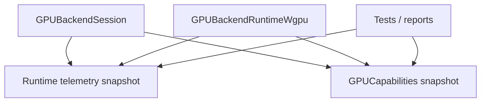

# Design: GPU baseline telemetry et capabilities initiales

Date: 2026-07-06
Statut: design valide par l'utilisateur, pret pour revue de spec

## Objectif

Mettre en place les deux premieres briques du refactor GPU sans changer le
rendu:

1. **Phase 0 - baseline telemetry**: mesurer ce que fait le runtime GPU actuel.
2. **Debut Phase 1 - capabilities**: exposer les limites backend utiles pour
   les prochaines etapes, surtout les alignements et tailles qui guideront les
   uniform slabs et les plans de ressources.

Le but est d'obtenir des preuves simples avant de refactorer les ressources ou
le batching. Cette etape doit dire "combien de passes, submissions et objets
GPU on cree", pas encore optimiser ces objets.

## Contexte

Le repo contient deja les contrats qu'il faut renforcer:

- `GPUCapabilities` dans `gpu-renderer/.../capabilities/CapabilityContracts.kt`;
- `GPUCommandSubmission` et `GPUExecutionCapabilities` dans
  `gpu-renderer/.../execution/ExecutionContracts.kt`;
- `GPUBackendSession` et le runtime concret dans
  `gpu-renderer/.../execution/GPUBackendRuntimeContracts.kt` et
  `GPUBackendRuntimeWgpu.kt`;
- `GPUCacheTelemetryEvent` et les compteurs de cache dans
  `gpu-renderer/.../telemetry/TelemetryContracts.kt`;
- des tests de smoke runtime et de telemetry cache dans
  `gpu-renderer/src/test/kotlin/.../execution`.

La bonne approche est donc d'etendre ces contrats existants. Il ne faut pas
ajouter une architecture parallele ni introduire des noms `Wgpu*` comme
concepts publics.

## Perimetre

Inclus:

- nouveau modele de telemetry runtime GPU;
- exposition des compteurs via `GPUBackendSession`;
- instrumentation non intrusive du runtime concret;
- enrichissement minimal de `GPUCapabilities` pour les limites utiles;
- tests unitaires et smoke tests cibles.

Exclus:

- pas de changement de rendu;
- pas de nouveau batching;
- pas de provider concret pour uniform slabs ou bind groups;
- pas de changement de pipeline key;
- pas de modification des images GM de reference;
- pas de nouvelle promesse de support Skia.

## Architecture proposee

### 1. Runtime telemetry

Ajouter un petit contrat de telemetry runtime dans le package `telemetry` ou
`execution`.

Forme cible:

```kotlin
data class GPUBackendRuntimeTelemetry(
    val renderPasses: Long,
    val offscreenPasses: Long,
    val windowPasses: Long,
    val submissions: Long,
    val buffersCreated: Long,
    val texturesCreated: Long,
    val bindGroupsCreated: Long,
    val samplersCreated: Long,
    val queueWrites: Long,
)
```

Un dump stable doit etre disponible:

```text
gpu-runtime.telemetry renderPasses=2 offscreenPasses=1 windowPasses=0
submissions=2 buffersCreated=4 texturesCreated=2 bindGroupsCreated=2
samplersCreated=1 queueWrites=4
```

Les noms exacts peuvent etre ajustes pour suivre les conventions locales, mais
les compteurs doivent rester simples et agreges.

### 2. Exposition via `GPUBackendSession`

Ajouter a `GPUBackendSession` une propriete de lecture:

```kotlin
val runtimeTelemetry: GPUBackendRuntimeTelemetry
```

Le comportement par defaut doit retourner un snapshot vide ou zero. Les tests et
les sessions qui ne sont pas le runtime concret ne doivent pas etre forces de
simuler un backend.

### 3. Instrumentation du runtime concret

Dans `GPUBackendRuntimeWgpu.kt`, incrementer les compteurs aux points deja
centralises:

- `encode`: une render pass principale et une submission;
- `encodeOffscreenTextureInternal`: une offscreen pass et une submission;
- `encodeAndPresent`: une window pass et une submission si la frame est
  presentee;
- `device.createBuffer`: buffer cree;
- `device.createTexture`: texture creee;
- `device.createBindGroup`: bind group cree;
- `device.createSampler`: sampler cree;
- `queue.writeBuffer`: ecriture queue.

Les compteurs doivent etre observes apres coup. Ils ne doivent pas piloter les
decisions de rendu.

### 4. Capabilities initiales

Etendre `GPUCapabilities` ou ajouter une structure associee pour exposer les
limites backend utiles:

```kotlin
data class GPULimits(
    val maxTextureDimension2D: Long,
    val copyBytesPerRowAlignment: Long,
    val minUniformBufferOffsetAlignment: Long,
)
```

Ces limites doivent etre convertibles en `GPUCapabilityFact` pour les dumps et
diagnostics:

```text
capability.fact name=minUniformBufferOffsetAlignment source=device.limits
value=256 affectsValidity=true evidence=runtime
```

Valeurs attendues pour cette premiere tranche:

- `copyBytesPerRowAlignment`: au moins la valeur actuellement assumee, 256;
- `maxTextureDimension2D`: valeur observee si disponible, sinon la valeur
  actuelle deja utilisee par le runtime;
- `minUniformBufferOffsetAlignment`: valeur observee si disponible, sinon 256
  comme valeur conservatrice.

Si l'API runtime ne permet pas encore de lire une limite de maniere fiable, la
valeur doit etre marquee comme conservatrice dans la source du fact. Il ne faut
pas cacher cette hypothese.

## Flux de donnees



Lecture:

- le runtime produit des compteurs;
- les tests lisent ces compteurs;
- les capabilities exposent les limites utiles;
- aucune decision de rendu ne change dans cette tranche.

## Gestion des erreurs

Cette tranche ne doit pas ajouter de nouveaux chemins d'echec runtime sauf si
une limite invalide est construite.

Regles:

- un compteur ne peut pas devenir negatif;
- une limite capability doit etre strictement positive;
- une limite inconnue doit etre remplacee par une valeur conservatrice avec une
  source explicite;
- les dumps ne doivent jamais exposer de handles backend;
- les erreurs de lecture de limits ne doivent pas faire croire que la capability
  est observee si elle ne l'est pas.

## Tests requis

### Tests de contrats

- `GPUBackendRuntimeTelemetry` initialise des compteurs a zero.
- Les increments produisent des valeurs deterministes.
- Le dump ne contient pas de `@`, pointeur, handle ou objet backend.
- `GPULimits` refuse les valeurs nulles ou negatives.
- Les limits produisent des `GPUCapabilityFact` stables.

### Tests runtime smoke

- Une scene offscreen simple augmente `renderPasses` et `submissions`.
- Une texture offscreen augmente `offscreenPasses`.
- Les creations de buffers/textures/bind groups/samplers sont visibles.
- Les compteurs de cache existants restent disponibles.

### Tests de non-regression

- Les tests `GPUBackendRuntimeWgpuSmokeTest` restent verts.
- Les tests `GPUExecutionCacheContractsTest` restent verts.
- Aucun test ne depend d'une valeur de compteur trop precise si le backend peut
  creer un objet supplementaire pour validation interne. Les assertions doivent
  verifier des minimums ou des invariants stables.

## Criteres d'acceptation

Cette tranche est acceptable si:

- le runtime expose une telemetry runtime lisible via `GPUBackendSession`;
- les compteurs couvrent passes, submissions, resources et queue writes;
- les capabilities exposent `maxTextureDimension2D`,
  `copyBytesPerRowAlignment` et `minUniformBufferOffsetAlignment`;
- les tests prouvent que les dumps sont stables et sans handles;
- aucune image GM ou logique de rendu ne change;
- la modification reste limitee aux contrats, runtime GPU et tests associes.

## Risques et mitigations

| Risque | Mitigation |
| --- | --- |
| Compteurs trop precis et fragiles | Tester des invariants et minimums plutot que des valeurs exactes partout |
| Confusion entre valeur observee et fallback conservateur | Encoder la source du fact capability |
| Duplication des contrats existants | Etendre `GPUCapabilities` et `GPUBackendSession`, ne pas creer de couche parallele |
| Impact sur rendu | Instrumentation passive uniquement |
| Scope qui derive vers provider/batching | Reporter uniform slab, bind group cache et batching aux phases suivantes |

## Plan de migration apres cette tranche

Une fois cette tranche en place:

1. utiliser `minUniformBufferOffsetAlignment` pour specifier l'uniform slab;
2. brancher le futur `GPUResourceProvider` sur les compteurs existants;
3. ajouter une queue/lifetime explicite en reutilisant `submissions`;
4. seulement ensuite commencer le batching de passes simples.
