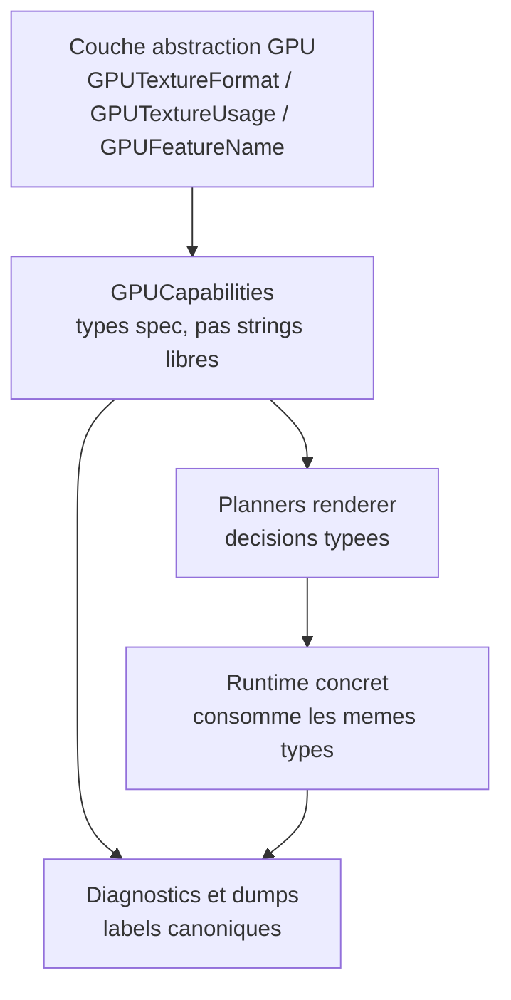

# GPU capabilities et abstraction DDD

## Objectif

Le modele de capabilities GPU doit utiliser le vocabulaire fourni par la
couche d'abstraction GPU au lieu de dupliquer ce vocabulaire sous forme de
strings Kanvas.

Le but est de suivre une approche DDD : quand la couche d'abstraction fournit
un concept de domaine stable, par exemple `GPUTextureFormat`,
`GPUTextureUsage` ou `GPUFeatureName`, les contrats renderer doivent consommer
ce concept directement. Kanvas ne doit creer un type local que lorsqu'il ajoute
une regle metier propre a Kanvas.

## Constat

La PR en cours a ajoute des champs de capabilities sous forme de labels :

- `GPUCapabilities.supportedTextureFormats: Set<String>`;
- `GPUCapabilities.supportedTextureUsageLabels: Set<String>`;
- `GPUCapabilities.featureLabels: Set<String>`;
- `validateTextureRequest(format: String, usageLabels: Set<String>)`.

Ces strings sont pratiques pour les dumps, mais elles affaiblissent le modele :

- elles peuvent drifter par faute de frappe ou variation de casing ;
- elles cachent que le vocabulaire existe deja dans la couche d'abstraction ;
- elles obligent les tests et planners a reconstruire une mini-spec locale ;
- elles rendent les migrations futures plus fragiles.

## Decision

Utiliser directement les enums et bitflags de la couche d'abstraction GPU dans
les contrats de capabilities.

`GPUImplementationIdentity` reste separe. Il decrit l'identite runtime :

- nom de facade ;
- nom d'implementation selectionnee ;
- adapter ;
- device ;
- vendor/device id quand disponibles.

Il ne porte pas les formats, usages ou features. Ces donnees sont des
capabilities, pas une identite.

## Modele cible

Les champs de `GPUCapabilities` deviennent types :

```kotlin
data class GPUCapabilities(
    val implementation: GPUImplementationIdentity,
    val facts: List<GPUCapabilityFact>,
    val knownUnsupportedFacts: List<GPUCapabilityFact> = emptyList(),
    val snapshotId: String,
    val limits: GPULimits? = null,
    val supportedTextureFormats: Set<GPUTextureFormat> = emptySet(),
    val supportedTextureUsage: GPUTextureUsage = GPUTextureUsage.None,
    val featureNames: Set<GPUFeatureName> = emptySet(),
)
```

`validateTextureRequest` devient typee :

```kotlin
fun GPUCapabilities.validateTextureRequest(
    format: GPUTextureFormat,
    width: Int,
    height: Int,
    usage: GPUTextureUsage,
): GPUCapabilityDiagnostic?
```

Les diagnostics gardent des strings parce qu'ils sont faits pour les dumps,
rapports et snapshots. La conversion vers string est centralisee :

```kotlin
fun GPUTextureFormat.dumpLabel(): String
fun GPUTextureUsage.dumpLabels(): List<String>
fun GPUFeatureName.dumpLabel(): String
```

## Flux de donnees



## Regles de frontiere

1. Les planners et contrats renderer peuvent importer les types de la couche
   d'abstraction GPU quand ces types representent la spec GPU.
2. Les planners ne doivent pas importer de types propres a une implementation
   concrete.
3. Les strings de format, usage ou feature sont interdites dans les contrats
   internes, sauf pour :
   - dumps ;
   - diagnostics ;
   - snapshots serialises ;
   - assertions de tests sur les sorties publiques.
4. Les mappings string doivent etre regroupes dans un helper unique et teste.
5. `GPUImplementationIdentity` ne doit pas devenir un fourre-tout de
   capabilities.

## Impact sur `GPUColorFormat`

`GPUColorFormat` dans `:kanvas` represente aujourd'hui un choix public de
format de surface. Deux options restent possibles :

- le remplacer par `GPUTextureFormat` si l'API publique Kanvas doit parler
  directement le vocabulaire de l'abstraction GPU ;
- le garder comme type metier Kanvas si l'on veut exposer seulement un
  sous-ensemble de formats de surface, mais alors il doit mapper vers
  `GPUTextureFormat`, pas vers une string libre.

La premiere etape de ce design ne force pas cette decision publique. Elle se
limite a `GPUCapabilities` et aux contrats renderer, ou les enums de la couche
d'abstraction sont clairement le bon langage de domaine.

## Plan d'implementation propose

1. Ajouter des helpers de dump pour `GPUTextureFormat`, `GPUTextureUsage` et
   `GPUFeatureName`.
2. Modifier `GPUCapabilities` pour utiliser les types de la couche
   d'abstraction GPU.
3. Adapter `validateTextureRequest` et `validateFeature`.
4. Migrer les tests capabilities pour construire des valeurs typees.
5. Migrer le runtime natif pour remplir `GPUCapabilities` avec les enums deja
   utilisees lors de la creation des ressources.
6. Mettre a jour les dumps et diagnostics pour conserver exactement les labels
   publics attendus.
7. Ajouter un audit qui refuse les nouveaux champs de capabilities en
   `Set<String>` quand un type de spec existe.

## Validation

La migration doit passer au minimum :

- `rtk ./gradlew :gpu-renderer:test --tests org.graphiks.kanvas.gpu.renderer.capabilities.GPUCapabilityContractsTest`
- `rtk ./gradlew :gpu-renderer:test --tests org.graphiks.kanvas.gpu.renderer.execution.GPURuntimeBaselineSnapshotTest`
- `rtk ./gradlew :kanvas:compileKotlin :gpu-renderer:test`

Verifier aussi :

- les dumps gardent les memes labels publics (`rgba8unorm`,
  `render_attachment`, etc.) ;
- aucun nouveau wording public ne revele l'implementation concrete ;
- aucune image regeneree n'est commit sans justification visuelle explicite.

## Non-objectifs

- Ne pas changer le rendu.
- Ne pas etendre la liste de formats supportes.
- Ne pas modifier les thresholds GM.
- Ne pas faire une refonte de l'API publique `:kanvas` dans la meme etape.
- Ne pas ajouter de nouvelle abstraction multi-backend.

## Risques

| Risque | Mitigation |
| --- | --- |
| Couplage excessif a la dependance de types GPU | Accepter ce couplage uniquement pour les types de spec, pas pour les types runtime concrets. |
| Diffs larges dans les tests | Migrer d'abord `GPUCapabilityContractsTest`, puis les fixtures par petits groupes. |
| Changement involontaire des dumps | Garder des tests de labels exacts et centraliser les formatters. |
| Confusion entre identite et capabilities | Laisser `GPUImplementationIdentity` inchange et documenter la frontiere. |

## Criteres d'acceptation

- `GPUCapabilities` n'expose plus de formats/usages/features sous forme de
  strings libres.
- Les validations de texture et de feature prennent des types GPU.
- Les diagnostics restent stables et lisibles.
- Les tests prouvent que les labels publics n'ont pas change.
- La branche ne change pas le pourcentage de support GM.
