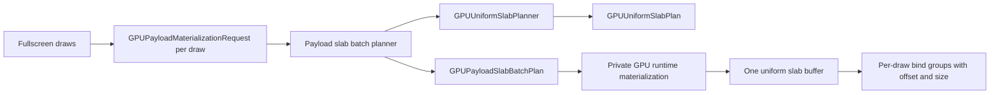
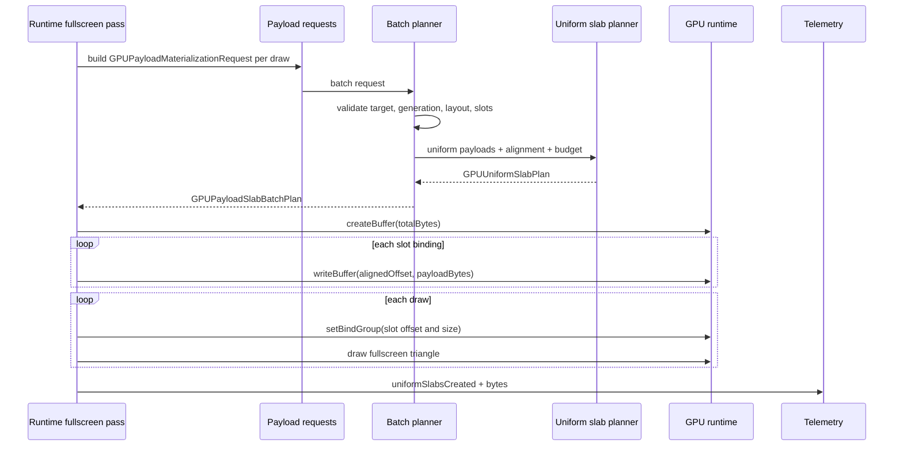
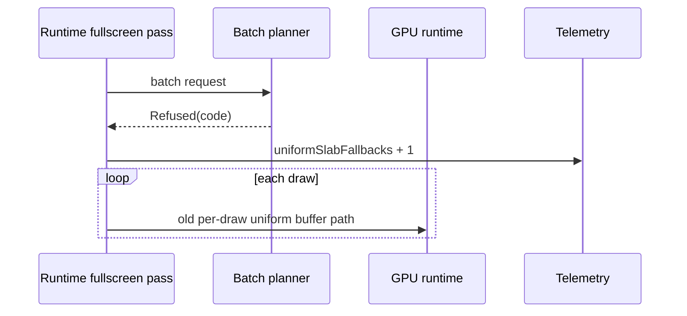

# Design: GPU payload slab materialization

Date: 2026-07-06
Statut: design valide par l'utilisateur, pret pour revue de spec

## Objectif

La tranche precedente a prouve un prototype de **uniform slab** (buffer
uniforme groupe) sur `recordFullscreenUniformPass`. Elle partait directement
des draws runtime et construisait un `GPUUniformSlabPlan` prive avant de creer
un seul buffer uniforme GPU.

La prochaine tranche doit raccorder ce prototype aux contrats de
`GPUPayloadMaterializationRequest`. Le but est de faire passer le slab par la
frontiere resource/provider deja presente dans Kanvas, sans encore ajouter de
cache global, de pooling inter-frame, ou de support large pour toutes les
routes.

Le succes attendu est simple:

- plusieurs `GPUPayloadMaterializationRequest` compatibles peuvent etre
  regroupes dans un plan de slab backend-neutral;
- le plan reutilise `GPUUniformSlabPlanner` pour offsets, padding et hash;
- le runtime GPU consomme ce plan pour creer un seul slab uniforme;
- les refus restent stables et visibles;
- le chemin fullscreen conserve son rendu et sa telemetry.

Cette tranche ne promet pas encore une acceleration globale. Elle transforme le
prototype prive en brique d'architecture mieux alignee avec les providers.

## Contexte

Les briques disponibles sont:

- `GPUUniformSlabPayload`, `GPUUniformSlabPlan` et `GPUUniformSlabPlanner`
  dans `UniformSlabContracts.kt`;
- `GPUPayloadMaterializationRequest` et `ValidatingPayloadResourceProvider`
  dans `ResourceContracts.kt`;
- `GPUBackendRuntimeTelemetry` avec `uniformSlabsCreated`,
  `uniformSlabBytesAllocated` et `uniformSlabFallbacks`;
- une materialisation runtime privee dans `GPUBackendRuntimeWgpu.kt`, limitee
  a `recordFullscreenUniformPass`.

Le provider payload sait deja valider une request unitaire, produire des
operands `UniformBuffer` et `BindGroup`, et emettre une telemetry
`payload.materialization.telemetry` create/reuse/failure. Il ne faut pas
recreer un modele parallele: la nouvelle tranche doit composer avec ces
contrats.

Les contraintes d'architecture restent celles du projet:

- ne pas porter Ganesh ou Graphite;
- garder WebGPU comme backend GPU;
- garder les contrats `resources` sans handles WebGPU;
- garder la telemetry observationnelle;
- ne pas utiliser les valeurs uniformes comme axe de cache pipeline;
- produire des diagnostics stables plutot que des fallbacks silencieux.

## Perimetre

Inclus:

- un contrat backend-neutral de batch payload slab;
- un planner qui valide plusieurs `GPUPayloadMaterializationRequest`;
- un plan accepte qui relie slots, offsets, packet/resource/uniform slots et
  layout facts;
- une integration runtime limitee au fullscreen uniform path;
- un fallback explicite vers le chemin par draw quand le batch planner refuse;
- des tests de contrat, de runtime accepte et de runtime refuse;
- des dumps et diagnostics sans handles backend.

Exclus:

- pas de pooling de slabs;
- pas de cache global de slabs;
- pas de reuse inter-frame;
- pas de reuse global de bind groups;
- pas de route texture, stencil, text, color glyph ou vertex;
- pas de changement de WGSL;
- pas de changement de pipeline key;
- pas de claim performance globale;
- pas d'API publique exposee comme provider runtime complet.

## Architecture

La nouvelle couche vit dans `resources` et reste backend-neutral. Elle produit
un plan que le runtime peut materialiser, mais elle ne cree aucun buffer, bind
group, texture, sampler ou handle backend.



Responsabilites:

- `GPUPayloadMaterializationRequest` decrit les payloads et bindings attendus;
- le batch planner verifie que les requests sont compatibles pour un meme
  slab;
- `GPUUniformSlabPlanner` calcule la disposition memoire;
- le runtime GPU cree les objets backend et ecrit les bytes;
- la telemetry prouve si le slab a ete cree ou si le fallback a ete pris.

Cette separation evite deux erreurs:

- faire fuiter des handles WebGPU dans les contrats `resources`;
- faire du runtime un second systeme de validation qui ignore les requests
  deja produites par la couche provider.

## Composants

### 1. `GPUPayloadSlabBatchRequest`

Nouveau contrat backend-neutral.

Champs representatifs:

```kotlin
data class GPUPayloadSlabBatchRequest(
    val targetId: String,
    val frameId: String,
    val sourceLabel: String,
    val deviceGeneration: Long,
    val alignmentBytes: Long,
    val uploadBudgetBytes: Long,
    val payloadRequests: List<GPUPayloadMaterializationRequest>,
)
```

Regles:

- `payloadRequests` ne peut pas etre vide;
- tous les payloads doivent viser le meme `targetId`;
- toutes les generations device doivent correspondre;
- tous les payloads doivent avoir un `GPUUniformPayloadBlock` valide;
- les bytes uniformes ne peuvent pas etre vides;
- les labels `packetId`, `uniformSlot`, `resourceSlot` et `slotLabel` derives
  doivent etre uniques et dump-safe;
- le batch ne peut pas depasser `uploadBudgetBytes`.

Le `frameId` est une evidence de contexte. Il ne doit pas devenir un handle ou
un axe de cache durable.

### 2. `GPUPayloadSlabSlotBinding`

Ce contrat relie un slot du slab a la request d'origine.

Champs representatifs:

```kotlin
data class GPUPayloadSlabSlotBinding(
    val slotLabel: String,
    val packetId: String,
    val uniformSlotId: String,
    val resourceSlotId: String,
    val payloadFingerprint: String,
    val reflectedBindingLayoutHash: String,
    val alignedOffset: Long,
    val payloadBytes: Long,
)
```

Il sert a eviter une dependance implicite a l'ordre des listes. Le runtime peut
retrouver chaque binding par label stable, et les dumps peuvent expliquer quel
payload a ete place a quel offset.

### 3. `GPUPayloadSlabBatchPlan`

Plan accepte.

Champs representatifs:

```kotlin
data class GPUPayloadSlabBatchPlan(
    val planHash: String,
    val sourceLabel: String,
    val targetId: String,
    val frameId: String,
    val deviceGeneration: Long,
    val uniformSlabPlan: GPUUniformSlabPlan,
    val slotBindings: List<GPUPayloadSlabSlotBinding>,
)
```

Regles:

- `slotBindings` couvre exactement les slots du `uniformSlabPlan`;
- chaque `slotLabel` est unique;
- chaque offset/size correspond au slot du slab;
- le plan ne contient pas de handle backend;
- les dump lines restent deterministes.

### 4. `GPUPayloadSlabBatchPlanner`

Petit planner qui:

1. valide la compatibilite des requests;
2. derive des `GPUUniformSlabPayload`;
3. appelle `GPUUniformSlabPlanner`;
4. mappe les slots acceptes vers les requests d'origine;
5. retourne un resultat accepte ou refuse.

Forme representative:

```kotlin
sealed class GPUPayloadSlabBatchPlanningResult {
    data class Accepted(val plan: GPUPayloadSlabBatchPlan) : GPUPayloadSlabBatchPlanningResult()
    data class Refused(val diagnostic: GPUPayloadSlabBatchDiagnostic) : GPUPayloadSlabBatchPlanningResult()
}
```

Le planner ne remplace pas `ValidatingPayloadResourceProvider`. Il ajoute une
validation de regroupement pour plusieurs requests compatibles.

### 5. Runtime prive

`GPUBackendRuntimeWgpu.kt` reste le seul endroit qui materialise:

- `GPUBuffer`;
- `writeBuffer`;
- `BufferBinding(offset, size)`;
- bind groups reels;
- compteurs runtime.

Le runtime doit consommer un `GPUPayloadSlabBatchPlan`, creer un slab, ecrire
les payloads aux offsets prevus, puis binder chaque draw avec la plage
correspondante.

Si le batch planner refuse, le runtime garde le chemin actuel par draw et
incremente `uniformSlabFallbacks` une seule fois pour le pass.

## Flux de donnees



Fallback:



## Diagnostics

Codes proposes:

- `unsupported.payload_slab_empty_batch`;
- `unsupported.payload_slab_target_mismatch`;
- `unsupported.payload_slab_generation_mismatch`;
- `unsupported.payload_slab_layout_mismatch`;
- `unsupported.payload_slab_duplicate_slot`;
- `unsupported.payload_slab_uniform_missing`;
- `unsupported.payload_slab_empty_payload`;
- `unsupported.payload_slab_budget_exceeded`;
- `unsupported.payload_slab_dump_unsafe`.

Regles:

- un refus de batch ne doit pas appeler le runtime GPU;
- un refus de batch ne doit pas devenir un rendu CPU silencieux;
- le fallback live vers le chemin par draw doit etre visible dans
  `GPUBackendRuntimeTelemetry`;
- les facts dumpes ne doivent pas contenir `@`, handles, pointeurs ou labels
  backend natifs;
- les diagnostics doivent contenir assez de contexte pour expliquer pourquoi le
  batch est impossible sans exposer les bytes complets.

## Integration avec `ValidatingPayloadResourceProvider`

Le provider actuel garde son role:

- valider une request payload unitaire;
- produire des operands `UniformBuffer` et `BindGroup`;
- emettre `payload.materialization.telemetry`;
- refuser les usages, generations, layouts ou budgets invalides.

La nouvelle couche peut reutiliser ses conventions de labels et evidence facts,
mais elle ne doit pas transformer le provider evidence-only en provider runtime
public.

Decision de cette tranche:

- le batch planner accepte uniquement des requests deja constructibles et
  coherentes;
- le runtime peut encore creer les objets WebGPU lui-meme;
- la transition vers un vrai provider runtime live reste une tranche future.

## Tests requis

### Tests de contrats

- batch accepte avec trois requests compatibles;
- offsets alignes et `totalBytes` attendu;
- `slotBindings` correspondent aux `uniformSlot`, `resourceSlot`, `packetId`;
- `planHash` stable pour les memes inputs;
- changement de payload ou layout change le hash;
- refus si batch vide;
- refus si target mismatch;
- refus si device generation mismatch;
- refus si layout mismatch;
- refus si duplicate slot;
- refus si payload uniforme absent ou vide;
- refus si budget depasse;
- dumps sans handle backend.

### Tests provider/materialization

- le provider payload unitaire reste compatible avec les labels/facts du batch;
- les telemetry events create/reuse/failure existants restent inchanges;
- les decisions `Materialized` et `Refused` gardent des dump lines stables.

### Tests runtime

- fullscreen pass accepte: rendu identique, un slab cree, bytes attendus,
  absence des anciens buffers uniformes par draw;
- fullscreen pass refuse: rendu identique via fallback, `uniformSlabFallbacks`
  augmente de 1, `uniformSlabsCreated` reste stable;
- les tests existants `GPUBackendRuntimeWgpuSmokeTest` restent verts;
- la suite complete `:gpu-renderer:test` est relancee et son etat documente.

La suite complete n'est pas un critere bloquant si les 8 echecs connus hors
scope restent inchanges.

## Acceptation

La tranche est acceptable si:

- les batch contracts sont backend-neutral;
- le batch planner refuse les incompatibilites avant toute materialisation;
- le runtime fullscreen consomme un batch plan au lieu de construire son slab
  uniquement depuis les draws;
- le fallback est explicite, teste et mesure;
- les dumps restent deterministes et sans handles;
- aucun shader, pipeline key, route texture/stencil/vertex ou cache global
  n'est modifie;
- la PR documente les tests ciblés et le statut de la suite complete.

## Risques et mitigations

| Risque | Mitigation |
|---|---|
| Le batch planner duplique trop le provider payload | Limiter le planner aux invariants multi-request; garder les validations unitaires dans le provider. |
| Le runtime depend encore de l'ordre des listes | Utiliser `slotLabel` et `GPUPayloadSlabSlotBinding` comme cle stable. |
| Le batch devient un cache de fait | Interdire pooling/reuse global dans cette tranche. |
| Les diagnostics exposent trop d'information | Dumper labels, hashes, tailles et offsets, jamais les bytes complets ni handles. |
| La preuve de batching reste faible | Garder une assertion de buffer delta ou une preuve equivalente dans le smoke test. |

## Opportunites apres cette tranche

Si cette tranche est concluante:

1. bind group reuse sur les slabs;
2. pooling de slabs par frame ou target;
3. provider runtime live pour les uniform uploads;
4. integration avec les layouts reflechis WGSL;
5. extension progressive vers textured, vertex et stencil;
6. mesure de performance locale apres warmup.

Ces opportunites restent hors scope de cette spec.
