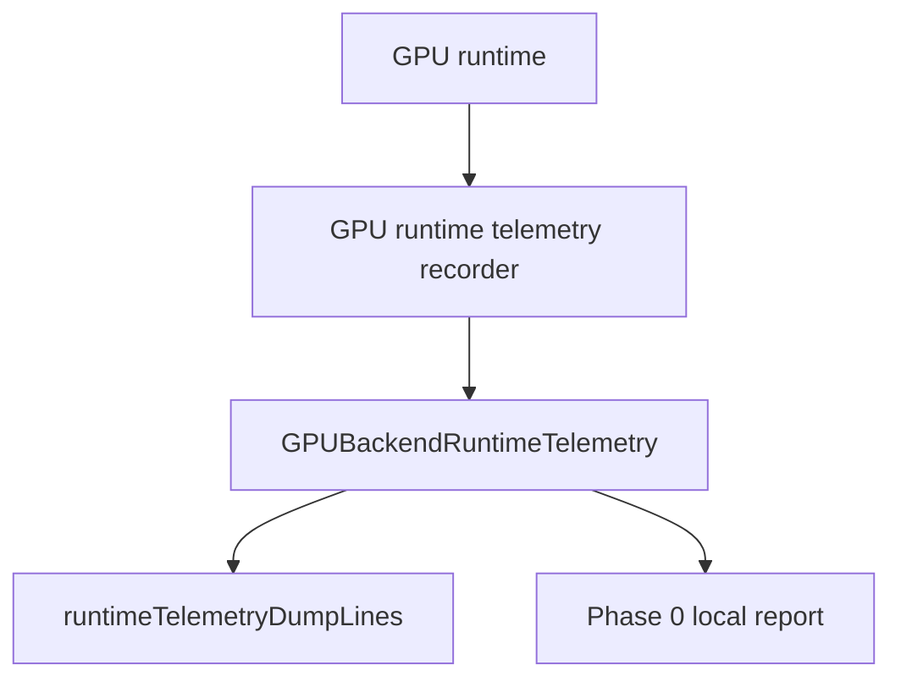

# Design: GPU Phase 0b baseline closure

Date: 2026-07-06
Statut: design valide par l'utilisateur, pret pour plan d'implementation

## Objectif

Fermer le risque de drift autour de la "Phase 0" du refactor GPU.

La tranche deja en place expose une telemetry runtime GPU et des limits GPU
conservatrices. La roadmap Phase 0 demande aussi un compteur de command
buffers et une preuve locale lisible qui dit clairement ce qui est termine et
ce qui reste hors scope.

Cette Phase 0b complete donc la baseline locale sans lancer le chantier
dashboard GM complet.

## Regle de wording

Le wording public reste neutre:

- utiliser "GPU" dans les specs, rapports, dumps et nouveaux noms publics;
- ne pas nommer l'implementation concrete dans les nouveaux textes publics;
- ne pas ajouter de champ public qui revele l'implementation concrete;
- les noms internes deja existants ne sont pas renommes dans cette tranche.

## Perimetre inclus

- Ajouter `commandBuffers` a `GPUBackendRuntimeTelemetry`.
- Dumper `commandBuffers` dans la ligne `gpu-runtime.telemetry`.
- Incrementer ce compteur quand le runtime produit un command buffer avec
  succes.
- Tester les valeurs par defaut, le rejet des valeurs negatives et le dump.
- Tester en smoke qu'une scene simple augmente `commandBuffers` avec les
  submissions.
- Ajouter un rapport local stable:
  `reports/gpu-renderer/phase-0-baseline.md`.

## Perimetre exclu

- Pas d'agregation complete par GM.
- Pas d'integration UI dans le dashboard GM.
- Pas de changement de rendu.
- Pas de batching.
- Pas de changement de pipeline key.
- Pas de nouvelle promesse de support Skia.
- Pas de renommage des classes internes existantes.

## Architecture



Le compteur reste passif. Il observe le runtime apres coup et ne pilote aucune
decision de rendu.

## Donnees

`GPUBackendRuntimeTelemetry` expose un nouveau compteur:

```kotlin
val commandBuffers: Long = 0L
```

La ligne de dump devient conceptuellement:

```text
gpu-runtime.telemetry renderPasses=... submissions=... commandBuffers=...
buffersCreated=... texturesCreated=... bindGroupsCreated=... samplersCreated=...
queueWrites=...
```

L'ordre exact doit suivre le style existant, mais `commandBuffers` doit etre
present dans le dump stable et rester un compteur agrege.

## Instrumentation runtime

Le runtime incrementera `commandBuffers` au point central ou un command buffer
est produit avec succes, juste apres la finalisation de l'encoder et avant la
submission.

La methode interne doit rester neutre, par exemple:

```kotlin
recordCommandBufferFinished()
```

ou:

```kotlin
recordCommandBufferCreated()
```

Le nom choisi doit refleter le point d'instrumentation reel.

## Rapport local Phase 0

Creer `reports/gpu-renderer/phase-0-baseline.md`.

Le rapport doit etre court et maintenable. Il doit contenir:

- statut: Phase 0 baseline locale close;
- compteurs disponibles:
  - render passes;
  - offscreen/window passes;
  - submissions;
  - command buffers;
  - buffers/textures/samplers/bind groups;
  - queue writes;
  - uniform slab counters;
- limits GPU exposees:
  - `maxTextureDimension2D`;
  - `copyBytesPerRowAlignment`;
  - `minUniformBufferOffsetAlignment`;
- preuve de validation:
  - tests de contrats runtime;
  - tests de capabilities;
  - smoke runtime GPU;
- follow-up explicite:
  - aggregation par GM;
  - integration dashboard GM;
  - rapport par famille.

Le rapport ne doit pas contenir de nom d'implementation specifique ni de handle.

## Gestion des erreurs

- `commandBuffers` doit refuser les valeurs negatives comme les autres
  compteurs.
- Le dump ne doit pas exposer d'identite d'objet GPU, de pointeur ou de handle.
- Si un command buffer n'est pas produit, le compteur ne doit pas augmenter.
- Une submission peut rester le compteur de reference pour la queue; cette
  tranche ne change pas la semantique de submission.

## Tests requis

### Contrats runtime

- `GPUBackendRuntimeTelemetry()` initialise `commandBuffers` a `0`.
- Une valeur negative de `commandBuffers` est refusee.
- `dumpLines()` contient `commandBuffers=0`.
- Le dump ne contient pas `@`, `0x`, ni nom d'implementation specifique ajoute
  par cette tranche.
- Les defaults de `GPUBackendSession` restent compatibles.

### Smoke runtime GPU

- Une scene simple augmente `commandBuffers`.
- `commandBuffers` augmente au moins avec les submissions observees dans le
  scenario teste.
- Les compteurs existants restent disponibles.
- Le rendu ne change pas.

### Rapport local

- Le fichier `reports/gpu-renderer/phase-0-baseline.md` existe.
- Il liste les compteurs et limits disponibles.
- Il declare explicitement les follow-ups hors Phase 0b.
- Il ne contient pas de nom d'implementation specifique.

## Criteres d'acceptation

Phase 0b est acceptable si:

- `commandBuffers` est expose, teste et dumpable;
- l'instrumentation est passive;
- le rapport local Phase 0 existe et evite l'ambiguite de statut;
- aucun nouveau wording public ne nomme l'implementation concrete;
- aucun rendu, GM golden ou pipeline key ne change;
- les tests cibles passent;
- le test complet du module ne revele pas de nouvel echec hors package-boundary
  deja connu.

## Definition de cloture

Apres cette tranche:

- Phase 0 est close pour la baseline locale GPU;
- l'integration dashboard GM et l'agregation par famille restent des follow-ups
  nommes, pas des criteres implicites de Phase 0b;
- Phase 1 peut continuer a utiliser les compteurs et limits exposes sans
  ambiguite de scope.
