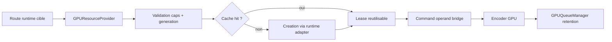
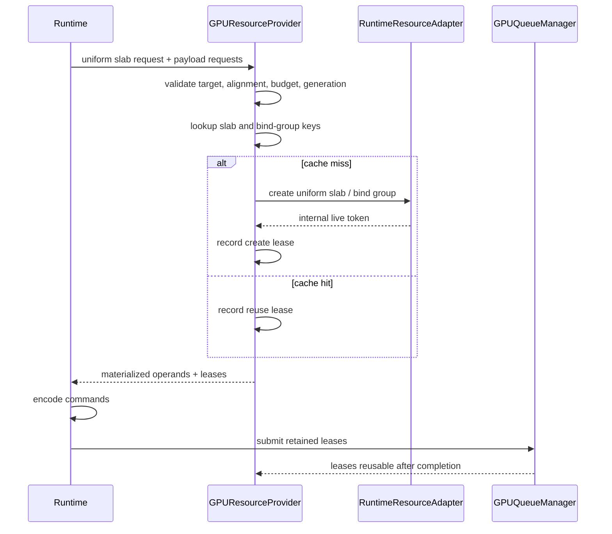
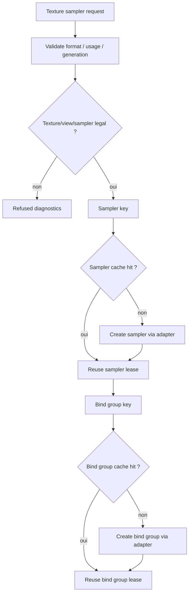

# Design: finalisation phase 2 provider GPU live leases

## Objectif

Finaliser la phase 2 du plan `refactor/` en mode agressif, sans demarrer le
batching generalise. Le but est de faire du `GPUResourceProvider` le point de
decision obligatoire pour les ressources frequentes d'un scope limite, puis de
prouver que cette decision produit une reutilisation observable ou une
explication stable.

La phase 2 ne doit plus etre seulement une evidence de validation. Elle doit
devenir une vraie frontiere de responsabilite:

- le provider decide quoi creer, reutiliser, refuser ou differer;
- le runtime ne decide plus localement les ressources principales des routes
  ciblees;
- les ressources retenues sont reliees au `GPUQueueManager`;
- les dumps restent neutres, sans handle brut ni nom d'implementation concrete.

## Contexte

Le rapport `refactor/05-roadmap.md` definit la phase 2 comme un
`GPUResourceProvider` minimal:

- uniform slab/ring pour petits payloads;
- padding base sur `GPUCapabilities.limits.minUniformBufferOffsetAlignment`;
- null buffer;
- cache bind group single-uniform;
- cache texture+sampler simple;
- device generation dans les cles;
- telemetry hit/miss/create/refuse.

La PR precedente a pose une premiere version:

- `GPUConcreteResourceProvider` existe;
- le chemin fullscreen uniform appelle deja le provider pour les payloads;
- les uniform slabs passent par un batch planner;
- `GPUQueueManager` existe comme scaffold de retention;
- les dumps de baseline incluent les lignes provider/queue.

L'ecart restant est que le runtime cree encore trop souvent les ressources
concretes au niveau local. Le provider observe et valide une partie du flux,
mais il ne possede pas encore assez la decision de creation/reutilisation pour
fermer la phase 2.

## Decision Retenue

Adopter l'approche **provider-owned leases, runtime adapter limite**.

Le provider devient proprietaire des decisions, des cles, des caches, des
refus et de la telemetry. Le runtime garde l'adaptation concrete bas niveau
derriere un petit port interne. Ce port ne devient pas une abstraction
multi-backend: il sert uniquement a permettre au provider de demander la
creation concrete d'une ressource sans exposer de handle dans les contrats
`resources`.



Cette decision est plus forte qu'une simple evidence, mais elle reste bornee:
elle ne deplace pas tout `GPURenderer`, ne lance pas le batching, et ne copie
pas les couches Graphite/Dawn.

## Scope Phase 2

La finalisation couvre quatre routes de ressources.

| Route | But phase 2 | Preuve attendue |
| --- | --- | --- |
| Uniform slab fullscreen | Provider decide create/reuse/refuse et remet une lease | deux frames equivalentes montrent au moins un reuse ou un refus/fallback stable |
| Bind group single-uniform | Cle provider-owned incluant layout, uniform lease et device generation | cache hit/miss visible |
| Null buffer | Ressource provider-owned, stable par generation | create puis reuse, stale generation refuse |
| Texture/sampler simple | Validation + cache sampler/view/binding limite | create/reuse/refuse distingue par telemetry |

Les autres ressources restent hors scope de cette tranche:

- vertex/index buffers generaux;
- textures intermediaires saveLayer/destination-read;
- readback/staging buffers complets;
- atlas texte;
- batching de passes;
- politique globale d'eviction.

## Contrats

### `GPUResourceLease`

Ajouter un contrat de lease dumpable, ou etendre un contrat existant s'il
remplit deja ce role.

Une lease represente un droit d'utiliser une ressource provider-owned. Elle ne
contient pas de handle brut. Elle doit porter seulement des faits stables:

- `leaseId`;
- `resourceKind`;
- `deviceGeneration`;
- `descriptorHash`;
- `ownerScope`;
- `usageLabels`;
- `releasePolicy`;
- `cacheResult`;
- `evidenceFacts`.

Exemple de dump attendu:

```text
resource-provider.lease id=uniform-slab:frame-1 kind=uniform-slab result=create
deviceGeneration=11 owner=fullscreen-pass release=submission-complete
usage=copy_dst,uniform descriptor=sha256:...
```

### `GPURuntimeResourceAdapter`

Le runtime expose au provider un port interne minimal. Ce port peut creer les
objets concrets, mais il ne fuit pas hors du runtime.

Responsabilites:

- creer un uniform slab;
- creer ou reutiliser un null buffer;
- creer un sampler simple;
- creer un bind group single-uniform;
- signaler les echecs avec un diagnostic stable.

Non-responsabilites:

- choisir les cles de cache;
- decider les fallbacks;
- exposer les handles dans les dumps;
- devenir une abstraction multi-backend publique.

### `GPUConcreteResourceProvider`

Le provider orchestre les decisions:

- validation target/frame/device generation;
- validation usage/format/alignment/budget via capabilities et requests;
- calcul des cles de cache;
- choix `create`, `reuse`, `refuse`, `deferred`;
- emission des leases;
- emission de telemetry stable.

Les lanes de telemetry recommandees:

- `uniform-slab`;
- `null-buffer`;
- `bind-group`;
- `texture`;
- `texture-view`;
- `sampler`.

Les resultats recommandes:

- `create`;
- `reuse`;
- `refuse`;
- `deferred`;
- `stale-generation`;
- `adapter-failure`.

## Flux Uniform Slab



Le runtime ne doit plus construire directement le plan local de ressources pour
ce chemin. Il garde seulement l'encodage et l'appel au backend concret a
travers l'adapter.

Si le provider refuse, le fallback existant peut rester actif pour garder le
rendu stable. La difference est que le fallback doit etre visible:

```text
resource-provider.cache lane=uniform-slab result=refuse ...
gpu-phase2.fallback route=fullscreen-uniform reason=unsupported.resource.uniform_alignment
```

## Flux Texture/Sampler Simple

La route texture/sampler doit etre moins ambitieuse que les uniform slabs, mais
elle doit produire de vraies decisions de cache.



Le scope texture peut rester limite a une texture simple deja disponible ou
uploadable par le chemin existant. L'objectif de phase 2 est le provider/cache,
pas l'extension image globale.

## Gestion D'Erreur

Les refus doivent rester stables et exploitables:

| Code | Sens |
| --- | --- |
| `unsupported.resource.device_generation_stale` | request et contexte ne ciblent pas la meme generation device |
| `unsupported.resource.uniform_alignment` | offset ou taille incompatible avec l'alignement courant |
| `unsupported.resource.upload_budget_exceeded` | payload ou upload au-dessus du budget |
| `unsupported.texture.usage_missing` | usage requis absent |
| `unsupported.texture.device_generation_stale` | texture/sampler request stale |
| `unsupported.resource.cache_key_unsafe` | cle ou label non dump-safe |
| `unsupported.resource.adapter_create_failed` | creation concrete echouee dans l'adapter |

Un refus provider ne doit jamais etre transforme en support silencieux. Il doit
etre soit:

- fallback explicite avec diagnostic;
- deferred explicite;
- erreur terminale si aucun fallback correct n'existe.

## Invariants

- Les dumps publics utilisent le vocabulaire `GPU`.
- Aucun dump ne contient de handle, adresse, token natif ou nom
  d'implementation concrete.
- Les cles de cache incluent `deviceGeneration`.
- Les valeurs uniformes ne deviennent pas des axes de pipeline.
- Les leases temporaires ne sont reutilisables qu'apres completion ou release
  explicite par le `GPUQueueManager`.
- Les anciens chemins runtime restent disponibles comme fallback pendant cette
  phase.

## Tests

### Tests Unitaires Provider

- `GPUConcreteResourceProviderTest`:
  - null buffer create/reuse/stale generation;
  - uniform slab lease create/reuse/refuse;
  - bind group single-uniform hit/miss;
  - texture/sampler simple create/reuse/refuse;
  - diagnostics dump-safe.

- `GPUResourceProviderTest`:
  - les leases ne dumpent pas de handle;
  - les plans stale refusent avant materialization;
  - les labels unsafe refusent.

### Tests Runtime

- `GPUBackendRuntimeNativeSmokeTest`:
  - le chemin fullscreen uniform expose des leases provider;
  - deux frames equivalentes montrent un `reuse` ou une reduction mesurable;
  - les leases sont retenues par `GPUQueueManager`;
  - le fallback existant reste stable si le provider refuse.

### Tests Globaux

Commandes ciblees:

```bash
rtk ./gradlew :gpu-renderer:test --tests org.graphiks.kanvas.gpu.renderer.resources.GPUConcreteResourceProviderTest
rtk ./gradlew :gpu-renderer:test --tests org.graphiks.kanvas.gpu.renderer.execution.GPUBackendRuntimeNativeSmokeTest
rtk ./gradlew :gpu-renderer:test
```

Si le runtime change le rendu ou les compteurs d'execution de facon notable:

```bash
rtk ./gradlew :integration-tests:skia:generateSkiaScan --args='--from 0 --to 8 --timeout 20'
rtk ./gradlew :integration-tests:skia:generateSkiaDashboard
```

Comparer le support percentage au baseline de branche avant de conclure.

## Criteres De Fin

La phase 2 est terminee quand:

- les routes ciblees passent par le provider pour les decisions de ressources;
- le provider retourne des leases dumpables et retenables;
- au moins un chemin runtime montre `create` puis `reuse` provider;
- les creations locales restantes sont soit hors scope, soit justifiees par un
  dump de fallback;
- `GPUQueueManager` retient les leases jusqu'a completion/release;
- les tests provider et runtime cibles passent;
- `:gpu-renderer:test` passe;
- il n'y a pas de regression forte du support GM;
- aucun nouveau wording public ne fuite l'implementation concrete.

## Non-Objectifs

- Pas de pass batching generalise.
- Pas de migration complete de `GPURenderer`.
- Pas de correction visuelle opportuniste.
- Pas de planner destination-read/MSAA complet.
- Pas de politique globale d'eviction.
- Pas de remplacement des contrats Kanvas par des noms ou objets Graphite.

## Risques Et Mitigations

| Risque | Mitigation |
| --- | --- |
| Le provider devient trop proche du backend concret | Garder les handles dans l'adapter runtime uniquement |
| PR trop large | Limiter aux quatre routes phase 2 |
| Reuse trop tot d'une ressource encore utilisee | Relier les leases au `GPUQueueManager` |
| Changement visuel involontaire | Garder fallback existant et lancer GM smoke/dashboard si necessaire |
| Dumps trop verbeux | Dumps agreges par lane, pas par pixel/draw |
| Fuite de wording concret | Tests/audits dump-safe et wording `GPU` |

## Schema De Responsabilite

```text
resources/
  GPUResourceProvider
    - valide les requests
    - decide cache create/reuse/refuse
    - produit leases + telemetry

execution/
  GPURuntimeResourceAdapter
    - cree les objets concrets
    - garde les tokens internes
    - encode avec les operands fournis

execution/
  GPUQueueManager
    - retient les leases
    - marque completion
    - autorise release/reuse
```

La frontiere importante est simple: `resources` decide, `execution` materialise
concretement et soumet.
