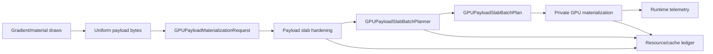
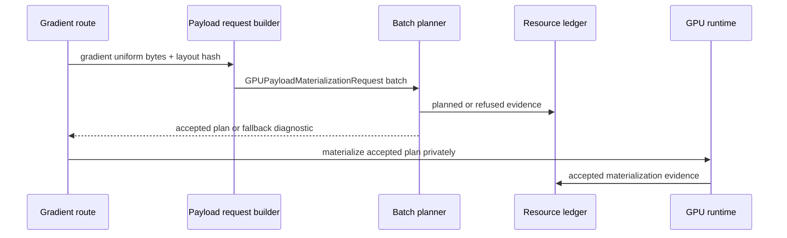

# Design: GPU slab resource ledger et route gradient pilote

Date: 2026-07-06
Statut: design valide par l'utilisateur, pret pour revue de spec

## Objectif

La tranche precedente a rendu les **payload slabs** utilisables par le chemin
fullscreen uniform. Elle a prouve qu'un groupe de
`GPUPayloadMaterializationRequest` compatibles peut etre planifie par un contrat
backend-neutral, puis materialise en prive par le runtime GPU.

La prochaine tranche combine deux objectifs, dans cet ordre:

1. **B - Resource/cache hardening**: ajouter une couche d'observation plus
   robuste autour des payload slabs, des generations, des invalidations, des
   budgets et des diagnostics.
2. **A - Route pilote gradient/material**: appliquer cette base a une premiere
   route concrete de gradients uniform-only.

Le but n'est pas de creer un cache global ou une acceleration generale. Le but
est de rendre la frontiere slab plus auditable avant de la copier dans d'autres
familles de rendu.

## Contexte

Les briques deja presentes sont:

- `GPUUniformSlabPlanner`, `GPUUniformSlabPlan` et leurs diagnostics;
- `GPUPayloadSlabBatchPlanner` et `GPUPayloadSlabBatchPlan`;
- `GPUPayloadMaterializationRequest` et `ValidatingPayloadResourceProvider`;
- `GPUBackendRuntimeTelemetry`;
- l'implementation concrete du runtime GPU, qui materialise les buffers et
  bind groups en prive;
- `GradientWgslShaderProvider.uniformBytesFor(...)`, qui produit deja des
  bytes uniformes pour les gradients;
- `drawFullscreenUniformPayloadPass`, qui accepte deja des payloads uniformes
  prepackes.

Les contraintes restent:

- ne pas porter Ganesh ou Graphite;
- garder WebGPU comme backend GPU;
- garder les contrats `resources` sans handles backend;
- ne pas exposer de details runtime dans les plans dumpables;
- ne pas utiliser les valeurs uniformes comme axes de cache pipeline;
- produire des diagnostics stables plutot que des fallbacks silencieux;
- eviter le wording backend-specific dans les nouvelles surfaces publiques:
  parler de GPU et de WebGPU au niveau architecture, pas d'une implementation
  particuliere.

## Perimetre

Inclus:

- un ledger backend-neutral et borne pour les evenements de payload slab;
- des diagnostics plus lisibles pour generation, layout, budget et
  invalidation;
- un lien clair entre plan accepte, fallback et contexte resource/cache;
- une route pilote limitee aux gradients/materials uniform-only;
- des tests unitaires du ledger et des refus;
- des tests runtime ciblant un pass gradient accepte et un fallback gradient;
- des dumps sans handles backend.

Exclus:

- pas de cache global de slabs;
- pas de pooling inter-frame;
- pas de reuse global de bind groups;
- pas de textures, samplers, images, glyphs ou runtime effects dans cette
  tranche;
- pas de changement de WGSL;
- pas de changement de pipeline key;
- pas de modification des references GM;
- pas de correction du test package-boundary global dans cette spec;
- pas de claim performance globale.

## Architecture

La tranche garde le plan de slab comme contrat backend-neutral. Elle ajoute un
ledger d'observation qui explique ce que le planner et le runtime ont decide.
Le ledger ne decide rien lui-meme.



Responsabilites:

- `GPUPayloadSlabBatchPlanner` continue de valider les requests et de produire
  un plan.
- `GPUPayloadSlabResourceLedger` enregistre des evenements dumpables autour du
  plan et des refus.
- Le runtime GPU materialise toujours les objets backend en prive.
- La route gradient pilote transforme des draws gradient uniform-only en
  payload requests compatibles.

Le ledger est volontairement limite. Il donne des preuves lisibles, pas une
politique de cache.

## Phase B: resource/cache hardening

### `GPUPayloadSlabResourceLedger`

Nouveau contrat backend-neutral.

Forme representative:

```kotlin
class GPUPayloadSlabResourceLedger(
    maxEvents: Int,
) {
    fun record(event: GPUPayloadSlabResourceEvent)
    fun dumpLines(): List<String>
}
```

Regles:

- le ledger est borne par `maxEvents`;
- les evenements les plus anciens sont supprimes quand la limite est depassee;
- chaque dump line est deterministe;
- aucune dump line ne contient `wgpu`, `WGPU`, `@` ou `0x`;
- le ledger ne contient pas de handle, buffer, bind group, texture ou sampler;
- le ledger ne remplace pas `GPUBackendRuntimeTelemetry`.

### `GPUPayloadSlabResourceEvent`

Evenements representatifs:

```kotlin
sealed interface GPUPayloadSlabResourceEvent {
    data class Planned(
        val sourceLabel: String,
        val targetId: String,
        val frameId: String,
        val deviceGeneration: Long,
        val payloadCount: Int,
    ) : GPUPayloadSlabResourceEvent

    data class Accepted(
        val sourceLabel: String,
        val planHash: String,
        val totalBytes: Long,
        val slotCount: Int,
    ) : GPUPayloadSlabResourceEvent

    data class Fallback(
        val sourceLabel: String,
        val reason: String,
        val payloadCount: Int,
    ) : GPUPayloadSlabResourceEvent

    data class Invalidated(
        val sourceLabel: String,
        val targetId: String,
        val reason: String,
    ) : GPUPayloadSlabResourceEvent

    data class BudgetRefused(
        val sourceLabel: String,
        val requestedBytes: Long,
        val budgetBytes: Long,
    ) : GPUPayloadSlabResourceEvent
}
```

Facts minimales:

- `sourceLabel`;
- `targetId`;
- `frameId`;
- `deviceGeneration`;
- `payloadCount`;
- `totalBytes` quand disponible;
- `reason` quand un refus ou fallback arrive;
- `layoutHash` quand cela aide a expliquer une incompatibilite.

Le `targetId` et le `frameId` restent des labels d'evidence. Ils ne doivent pas
devenir des handles ou des cles cache durables.

### Diagnostics

Les refus doivent rester stables:

- `unsupported.payload_slab_generation_mismatch`;
- `unsupported.payload_slab_layout_mismatch` avec `reason`;
- `unsupported.payload_slab_budget_exceeded`;
- `unsupported.payload_slab_resource_invalidated`;
- `unsupported.payload_slab_dump_unsafe`.

Les reasons attendues incluent:

- `binding_layout_mismatch`;
- `alignment_mismatch`;
- `device_generation_stale`;
- `target_generation_invalidated`;
- `upload_budget_exceeded`;
- `resource_fingerprint_mismatch`;
- `binding_fact_missing`;
- `binding_fact_unexpected`;
- `binding_usage_missing`;
- `binding_generation_stale`;
- `binding_resource_evicted`.

## Phase A: route pilote gradient/material

La route pilote utilise uniquement les payloads uniformes de gradients. Elle ne
gere pas les textures ni les samplers.

Flux cible:



La premiere integration doit viser le chemin qui possede deja:

- `GradientWgslShaderProvider.uniformBytesFor(...)`;
- `GradientWgslShaderProvider.uniformLayoutHashFor(...)`;
- `GPUBackendUniformPayloadDraw`;
- `drawFullscreenUniformPayloadPass`.

La route pilote doit utiliser un `sourceLabel` distinct, par exemple
`gradient-material-pass`, afin que les dumps separent clairement:

- fullscreen solid/uniform prototype;
- gradient/material pilote.

## Donnees et invariants

Chaque draw gradient pilote doit produire une request avec:

- `packetId` stable;
- `uniformSlotId` stable;
- `resourceSlotId` stable;
- `payloadFingerprint` derive des bytes uniformes;
- `reflectedBindingLayoutHash` derive du layout gradient;
- `resourceDescriptorLabels = listOf("uniform:gradient-material-payload")`;
- `dynamicOffsets = listOf(0L)`;
- `uploadCapabilityAvailable = true`;
- `requiredUniformUsageLabels = setOf("copy_dst", "uniform")`;
- `availableUniformUsageLabels` couvrant ces usages.

Compatibilite de batch:

- meme `targetId`;
- meme `frameId`;
- meme `deviceGeneration`;
- meme alignment;
- meme layout hash;
- labels uniques;
- budget total respecte;
- payload bytes non vides.

Un batch incompatible doit fallback vers le chemin existant par draw, avec un
evenement ledger et un compteur runtime de fallback. Il ne doit pas devenir un
rendu CPU silencieux.

## Tests requis

### Ledger

- enregistre des evenements dans l'ordre;
- borne le nombre d'evenements;
- dump lines deterministes;
- refuse ou filtre les labels non dump-safe;
- ne contient pas `wgpu`, `WGPU`, `@`, `0x`.

### Planner et hardening

- refuse generation mismatch avec diagnostic stable;
- refuse invalidation explicite avec `unsupported.payload_slab_resource_invalidated`;
- refuse layout mismatch avec `reason=binding_layout_mismatch`;
- refuse budget depasse;
- garde le mapping par `slotLabel`, pas par ordre implicite.

### Route gradient

- plusieurs draws gradient compatibles produisent un slab accepte;
- un layout gradient incompatible produit un fallback avec reason stable;
- un payload gradient vide ou non packable refuse avant materialisation GPU;
- les dumps distinguent `gradient-material-pass`;
- la telemetry runtime garde les compteurs existants.

### Compatibilite provider

- une request gradient acceptee par `ValidatingPayloadResourceProvider` peut
  alimenter un `GPUPayloadSlabBatchPlan`;
- une request refusee par le provider ne doit pas devenir acceptee par le
  planner.

## Criteres d'acceptation

La tranche est complete quand:

- la spec est citee par le plan d'implementation;
- les tests ciblant ledger, planner, provider compatibility et runtime gradient
  passent;
- `git diff --check` passe sur les fichiers touches;
- la PR existante est mise a jour;
- le statut de `:gpu-renderer:test` complet est documente.

Si le test complet echoue encore uniquement sur le package-boundary preexistant,
la tranche peut etre livree avec cette limite explicite. Elle ne doit pas
modifier ou masquer cet echec.

## Non-claims

Cette tranche ne claim pas:

- cache global de resources;
- reuse inter-frame;
- baisse mesuree de performance;
- support texture/image/bitmap;
- support text/glyph;
- support runtime effect large;
- compatibilite Graphite/Ganesh;
- correction de tous les problemes de package boundaries.

## Risques

- Le ledger peut devenir trop proche d'un cache actif. Mitigation: le garder
  append-only et observationnel.
- La route gradient peut melanger les anciens packers et les material
  dictionaries. Mitigation: la tranche pilote vise seulement le chemin
  `GradientWgslShaderProvider` et `drawFullscreenUniformPayloadPass`.
- Les diagnostics peuvent diverger entre provider et planner. Mitigation:
  ajouter des tests de compatibilite provider -> planner.
- Les fichiers sales hors perimetre peuvent masquer le statut des tests.
  Mitigation: stage/commit uniquement les fichiers de la tranche et documenter
  le statut exact.
