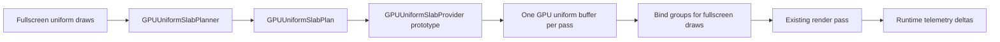
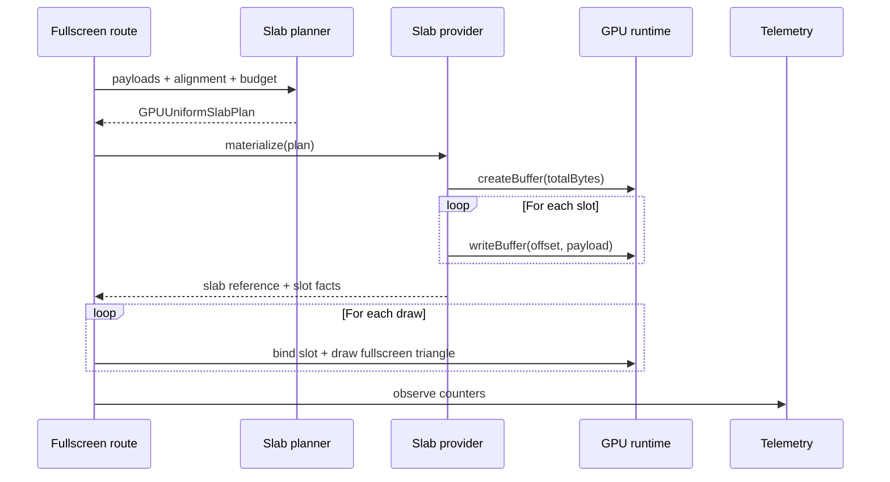

# Design: GPU uniform slab prototype pour fullscreen passes

Date: 2026-07-06
Statut: design valide par l'utilisateur, pret pour revue de spec

## Objectif

Construire la prochaine brique du refactor GPU apres la telemetry et les
capabilities de la PR #2002: un prototype limite de **uniform slab** (buffer
uniforme groupe) pour les fullscreen uniform passes.

Le but est de prouver une chaine simple:

- planifier plusieurs payloads uniformes dans un buffer logique unique;
- respecter l'alignement `minUniformBufferOffsetAlignment`;
- materialiser ce plan dans le runtime GPU pour une route limitee;
- mesurer l'effet avec la telemetry deja ajoutee;
- garder le rendu et les shaders inchanges.

Cette tranche ne promet pas encore une amelioration de performance globale. Elle
doit produire des preuves fiables avant un refactor plus large.

## Contexte

La PR #2002 a ajoute:

- `GPUBackendRuntimeTelemetry`;
- `GPULimits`;
- `GPUBackendSession.capabilities`;
- des compteurs passifs pour passes, submissions, buffers, textures, bind
  groups, samplers et queue writes.

Le code a deja des contrats de ressources backend-neutral dans
`gpu-renderer/src/main/kotlin/org/graphiks/kanvas/gpu/renderer/resources/ResourceContracts.kt`.
Il existe aussi un chemin runtime concret dans
`gpu-renderer/src/main/kotlin/org/graphiks/kanvas/gpu/renderer/execution/GPUBackendRuntimeWgpu.kt`
ou plusieurs routes creent encore des buffers uniformes, ecrivent les payloads,
puis creent les bind groups directement.

La prochaine tranche doit connecter ces deux mondes, mais seulement sur une
route prototype. Elle ne doit pas devenir un remplacement global de tous les
chemins de ressources.

## Perimetre

Inclus:

- contrats backend-neutral pour decrire un slab uniforme;
- planner deterministe pour calculer offsets, padding, taille totale et hash;
- provider runtime prototype pour les fullscreen uniform passes;
- integration limitee a la famille `drawFullscreen*Uniform*`;
- telemetry et tests qui comparent des deltas avant/apres dans ce chemin;
- diagnostics stables pour les refus.

Exclus:

- pas de changement de shader;
- pas de changement de pipeline key;
- pas de changement de GM reference;
- pas de pooling cross-frame;
- pas de cache global de slabs;
- pas de reuse global de bind groups;
- pas de port Graphite/Ganesh;
- pas de claim de performance sans mesure stable.

## Architecture

La tranche ajoute un plan backend-neutral et un prototype runtime prive ou
`internal`. Le plan peut etre teste sans WebGPU. Le provider concret ne sert
qu'a materialiser ce plan dans la route fullscreen uniforme.



Le point important est la separation:

- le planner sait calculer un plan dumpable;
- le provider sait creer les objets backend;
- la route fullscreen reste proprietaire de l'encodage du pass;
- la telemetry reste observationnelle et ne pilote pas les decisions.

## Composants

### 1. `GPUUniformSlabPlan`

Contrat pur qui decrit la disposition des payloads uniformes dans un slab.

Champs representatifs:

```kotlin
data class GPUUniformSlabPlan(
    val planHash: String,
    val sourceLabel: String,
    val deviceGeneration: Long,
    val alignmentBytes: Long,
    val totalBytes: Long,
    val uploadBudgetBytes: Long,
    val slots: List<GPUUniformSlabSlot>,
)

data class GPUUniformSlabSlot(
    val slotLabel: String,
    val payloadHash: String,
    val payloadBytes: Long,
    val alignedOffset: Long,
    val allocatedBytes: Long,
)
```

Regles:

- `alignmentBytes` est strictement positif;
- `totalBytes` est aligne et ne depasse pas `uploadBudgetBytes`;
- chaque `alignedOffset` respecte `alignmentBytes`;
- aucun label ou hash dumpable ne peut etre vide;
- le plan ne contient aucun handle backend.

### 2. `GPUUniformSlabPlanner`

Petit planificateur deterministe. Il prend:

- les payloads uniformes d'un pass;
- l'alignement venu de `GPULimits.minUniformBufferOffsetAlignment`;
- un budget d'upload;
- un label de source.

Il produit:

- un `GPUUniformSlabPlan` accepte;
- ou un refus stable avec diagnostic.

Le planner est le coeur testable de la tranche. Il ne depend pas du runtime GPU.

### 3. `GPUUniformSlabProvider` prototype

Provider runtime limite. Il prend un plan accepte et:

- cree un buffer uniforme de `totalBytes`;
- ecrit chaque payload a son `alignedOffset`;
- retourne une reference interne utilisable par la route fullscreen;
- expose des facts dumpables: plan hash, total bytes, slots, generation,
  alignment.

Le provider ne doit pas exposer de handles dans les dumps. Les objets backend
restent internes au runtime.

### 4. Integration fullscreen uniform pass

La route prototype est la famille `drawFullscreen*Uniform*`.

La route actuelle fait deja:

1. recevoir plusieurs draws;
2. construire un payload uniforme par draw;
3. creer les buffers/bind groups;
4. dessiner avec scissor.

La tranche remplace seulement la partie "un buffer uniforme par draw" par:

1. planifier tous les payloads du pass;
2. creer un slab uniforme;
3. binder chaque draw avec son offset/facts selon ce que le layout courant
   permet;
4. garder le rendu identique.

Si le layout courant ne permet pas encore les dynamic offsets, la tranche garde
un prototype moins ambitieux: un buffer slab unique et des bind groups par draw
qui pointent vers la region correcte si l'API le permet. Si ce n'est pas
possible de facon fiable, la route live garde le chemin actuel et emet un
diagnostic de fallback temporaire visible dans les dumps. Elle ne doit pas
rompre le rendu fullscreen existant seulement parce que le prototype slab n'est
pas encore applicable.

## Flux de donnees



## Diagnostics et erreurs

Les refus doivent etre stables et testables.

Codes proposes:

- `unsupported.uniform_slab_empty_payload`;
- `unsupported.uniform_slab_budget_exceeded`;
- `unsupported.uniform_slab_alignment_invalid`;
- `unsupported.uniform_slab_stale_generation`;
- `unsupported.uniform_slab_layout_incompatible`;
- `unsupported.uniform_slab_backend_materialization_failed`.

Regles:

- un payload vide est refuse avant materialisation;
- un offset non aligne est impossible si le planner est correct, mais reste un
  invariant teste;
- un budget depasse est refuse avant creation de buffer;
- une generation device incoherente est refusee avant materialisation;
- un fallback live vers le chemin actuel doit etre explicite dans les diagnostics;
- aucun refus ne doit etre transforme en rendu CPU silencieux.

## Telemetry attendue

La telemetry doit rester observationnelle. La tranche peut mesurer:

- `buffersCreated`;
- `bindGroupsCreated`;
- `queueWrites`;
- `renderPasses`;
- `submissions`.

Pour plusieurs draws fullscreen dans un meme pass, le resultat attendu est:

- `renderPasses` et `submissions` inchanges;
- `buffersCreated` ne doit plus augmenter lineairement avec le nombre de draws
  sur la route prototype si le slab est actif;
- `queueWrites` peut rester egal au nombre de payloads au debut, sauf si le
  provider ecrit un buffer agregat en une seule fois;
- `bindGroupsCreated` peut rester par draw dans cette tranche.

La spec ne demande pas une baisse globale. Elle demande une preuve locale,
lisible et comparable.

## Tests requis

### Tests de contrats

- le planner aligne correctement trois payloads de tailles differentes;
- `totalBytes` inclut le padding final attendu;
- `planHash` est stable pour les memes inputs;
- changer un payload change le hash;
- payload vide refuse;
- budget depasse refuse;
- alignement invalide refuse;
- labels et hashes non dump-safe refuses.

### Tests runtime smoke

- un fullscreen uniform pass avec deux ou trois draws rend comme avant;
- la route expose des facts de slab sans handle backend;
- les deltas telemetry montrent au moins un slab materialise;
- les compteurs de passes/submissions restent coherents;
- les tests existants de runtime GPU restent verts.

### Tests de non-regression

Commandes minimales:

```bash
rtk ./gradlew --no-daemon :gpu-renderer:test --tests org.graphiks.kanvas.gpu.renderer.execution.GPUBackendRuntimeContractsTest --tests org.graphiks.kanvas.gpu.renderer.capabilities.GPUCapabilityContractsTest --tests org.graphiks.kanvas.gpu.renderer.execution.GPUBackendRuntimeWgpuSmokeTest
rtk git diff --check origin/master...HEAD
```

La suite complete `:gpu-renderer:test` doit etre relancee et son etat documente.
Elle n'est pas un critere de blocage pour cette tranche tant que les 8 echecs
hors scope deja observes restent presents et inchanges.

## Criteres d'acceptation

La tranche est acceptable si:

- un plan de slab uniforme backend-neutral existe et est teste;
- le planner produit offsets, padding, tailles et hash deterministes;
- la route fullscreen uniform pass utilise le prototype quand les preconditions
  sont remplies;
- les diagnostics sont stables quand les preconditions echouent;
- le rendu des smoke tests existants ne change pas;
- la telemetry permet de voir la difference entre chemin actuel et chemin slab;
- aucun dump ne contient de handle backend, pointeur ou identite d'objet;
- le wording public reste `GPU`.

## Opportunites apres cette tranche

Si le prototype est concluant, les prochaines tranches pourront etendre:

1. bind group reuse sur les slabs;
2. pooling de slabs par frame ou target;
3. materialisation des payloads via les contrats `GPUPayloadMaterializationRequest`;
4. integration avec les layouts reflechis WGSL;
5. support progressif des routes vertex, textured et stencil.

Ces extensions ne font pas partie de cette spec. Elles dependent des preuves
de cette premiere route prototype.
