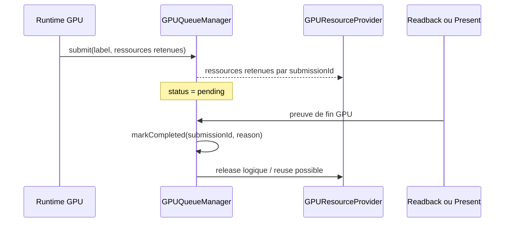

# Design: phase 3 queue et duree de vie GPU

## Objectif

Finaliser la phase 3 du dossier `refactor/` avec une etape complete mais
raisonnable.

Le but est simple : quand Kanvas envoie du travail au GPU, les ressources
utilisees par ce travail restent retenues jusqu'a une preuve claire que le GPU
a fini.

Cette phase couvre deux routes :

- le rendu offscreen, avec `readback` (lecture des pixels) ;
- le rendu fenetre, avec `present` reussi.

Elle ne lance pas encore le batching generalise.

## Pourquoi cette phase est necessaire

Les phases precedentes ont deja pose les bases :

- `GPUCaps` centralise les faits utiles ;
- `GPUResourceProvider` decide une partie des ressources ;
- `GPUQueueManager` existe deja ;
- les dumps phase 0 montrent les compteurs queue/provider.

Mais le `GPUQueueManager` reste surtout un echafaudage. Certaines soumissions
sont marquees terminees juste apres `submit`, avec une completion immediate.
Cela donne une evidence utile, mais pas encore une vraie regle de duree de vie.

La phase 3 doit rendre cette regle explicite :

```text
submit GPU
  -> ressources retenues
  -> attente ou preuve de fin
  -> completion
  -> release logique ou reuse
```

## Choix retenu

Nous retenons l'approche 2 : **offscreen + fenetre**.

En francais simple :

- offscreen : le GPU est considere termine apres la lecture des pixels ;
- fenetre : le GPU est considere termine apres un `present` reussi ;
- les ressources provider restent reutilisables seulement apres release logique ;
- les ressources temporaires ne doivent pas etre fermees trop tot quand elles
  sont encore liees a une soumission.

Dans ce document, une lease veut dire un droit d'utiliser une ressource GPU
pendant une soumission. Ce n'est pas le handle brut de la ressource.

Cette approche termine mieux la phase 3 qu'un simple test unitaire de
`GPUQueueManager`, sans prendre le risque d'une reecriture complete du runtime.

## Flux cible



## Regles de conception

### 1. `submit` ne veut pas dire fini

`queue.submit` signifie seulement que le travail a ete envoye au GPU. Il ne
doit pas suffire a liberer une ressource qui peut encore etre lue par le GPU.

Une soumission nouvelle commence donc en etat `pending`.

### 2. Le readback devient la preuve offscreen

Pour le rendu offscreen, `readRgba()` appelle deja une operation de lecture des
pixels. Cette operation est le meilleur point de synchronisation disponible
pour cette tranche.

La route cible devient :

```text
encode offscreen
  -> submit
  -> queue submission pending
  -> readRgba
  -> wait readback
  -> markCompleted(reason=readback-complete)
  -> releaseCompleted
```

Si plusieurs encodes arrivent avant un readback, la queue doit garder leurs
ressources retenues tant que la completion n'a pas ete observee.

### 3. Le present devient la preuve fenetre

Pour la route fenetre, la meilleure preuve simple est `present` reussi.

La route cible devient :

```text
encode window frame
  -> submit
  -> present
  -> markCompleted(reason=presented)
  -> releaseCompleted
```

Cela ne pretend pas mesurer une fence GPU parfaite. C'est une preuve de fin
pragmatique, adaptee a cette phase, et meilleure qu'une completion immediate.

### 4. Les ressources ont des politiques differentes

Toutes les ressources ne doivent pas etre fermees au meme moment.

| Type | Politique phase 3 |
| --- | --- |
| Uniform slab cachee | retenue par soumission, reutilisable apres release logique |
| Bind group cache | retenu par soumission, reutilisable apres release logique |
| Texture cible offscreen | retenue comme target pendant la soumission |
| Staging/readback buffer | retenu jusqu'a readback complet |
| Ressource temporaire de pass | retenue si elle peut etre encore utilisee par le GPU |
| Cache par generation device | garde sa politique generation/device |

La phase 3 ne doit pas fermer brutalement les caches provider. Elle doit
d'abord rendre leur utilisation par soumission visible et correcte.

## Changements attendus

### `GPUQueueManager`

Ajouter ou renforcer :

- etat `pending`, `completed`, `released` ;
- reason de completion stable, par exemple `readback-complete` ou `presented` ;
- compteur de waits ;
- compteur de releases ;
- acces a la derniere soumission pending quand une route readback en a besoin ;
- dumps sans handle brut.

### Route offscreen

Changer le flux pour que `encode()` :

- soumette le command buffer ;
- enregistre les ressources retenues ;
- laisse la soumission pending.

Changer `readRgba()` pour que :

- le wait readback soit compte ;
- la ou les soumissions offscreen concernees soient marquees completed ;
- `releaseCompleted()` soit appele apres le wait reussi.

### Route fenetre

Changer `encodeAndPresent()` pour que :

- la frame soit soumise via `GPUQueueManager` ;
- les leases de frame soient retenues ;
- `present()` reussi marque la soumission completed avec reason `presented` ;
- `releaseCompleted()` soit appele ensuite.

La route fenetre peut rester plus simple que la route offscreen si les tests
natifs ne sont pas toujours disponibles en CI.

## Diagnostics et telemetry

Les dumps doivent permettre de repondre a quatre questions :

1. Combien de soumissions ont ete envoyees ?
2. Combien sont terminees ?
3. Combien ont ete released ?
4. Quelle preuve a termine chaque soumission ?

Exemple attendu :

```text
gpu-queue.telemetry submitted=2 completed=2 released=2 waits=1 unknownCompletions=0
gpu-queue.submission id=1 label=offscreen-pass:... retained=3 completed=true released=true completion=readback-complete
gpu-queue.submission id=2 label=window-frame:... retained=2 completed=true released=true completion=presented
```

Les labels doivent rester neutres : pas de handle brut, pas d'adresse memoire,
pas de nom d'implementation concrete.

## Tests

### Tests unitaires

Ajouter ou adapter les tests de `GPUQueueManager` :

- une ressource retenue n'est pas released tant que la soumission est pending ;
- une completion inconnue augmente `unknownCompletions` ;
- `recordWait()` augmente le compteur de waits ;
- `releaseCompleted()` ne release qu'une fois ;
- les reasons de completion sont dump-safe.

### Tests runtime offscreen

Adapter les smoke tests :

- apres `encode()` sans readback, une soumission offscreen peut rester pending ;
- apres `readRgba()`, la soumission devient completed puis released ;
- le dump contient `completion=readback-complete` ;
- le rendu pixel reste identique.

### Tests runtime fenetre

Quand l'environnement permet la route fenetre :

- une frame presentee ajoute une soumission queue ;
- la completion est `presented` ;
- les leases de frame apparaissent dans la retention ;
- aucun wording public ne fuit l'implementation concrete.

Si la route fenetre est skippee par manque d'environnement, le skip doit rester
explicite.

### Tests de non-regression

Commandes visees :

```bash
rtk ./gradlew :gpu-renderer:test
rtk ./gradlew :gpu-renderer:test --tests org.graphiks.kanvas.gpu.renderer.execution.GPUBackendRuntimeNativeSmokeTest
rtk ./gradlew :integration-tests:skia:generateSkiaScan --args='--from 0 --to 8 --timeout 20'
```

Si les GMs sont regenerees, les changements PNG ne doivent etre commit que si
on a une justification visuelle explicite.

## Non-objectifs

Cette phase ne doit pas :

- introduire le batching generalise ;
- refaire `GPURenderer` ;
- changer les algorithmes de rendu blur, texte, path ou image ;
- transformer `GPUQueueManager` en scheduler complexe ;
- promettre une fence GPU parfaite si le backend ne l'expose pas encore ;
- fermer les caches provider a chaque frame.

## Critere de fin

La phase 3 est consideree terminee quand :

- `GPUQueueManager` ne marque plus les soumissions offscreen comme terminees
  immediatement apres submit ;
- `readRgba()` prouve la completion offscreen ;
- `encodeAndPresent()` passe par la queue et marque une completion `presented`
  quand la presentation reussit ;
- les ressources retenues sont visibles dans les dumps ;
- les tests prouvent pending -> completed -> released ;
- le rendu offscreen ne regresse pas.
