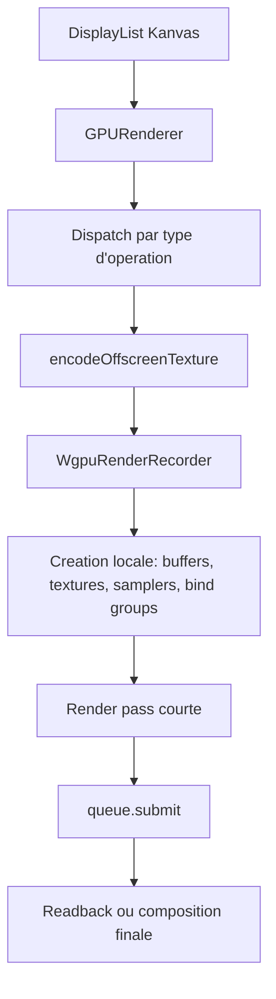
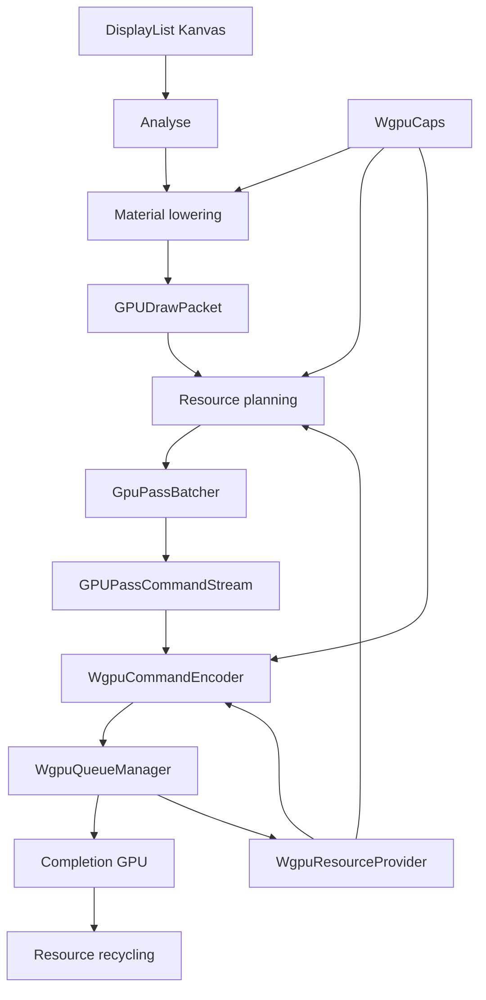
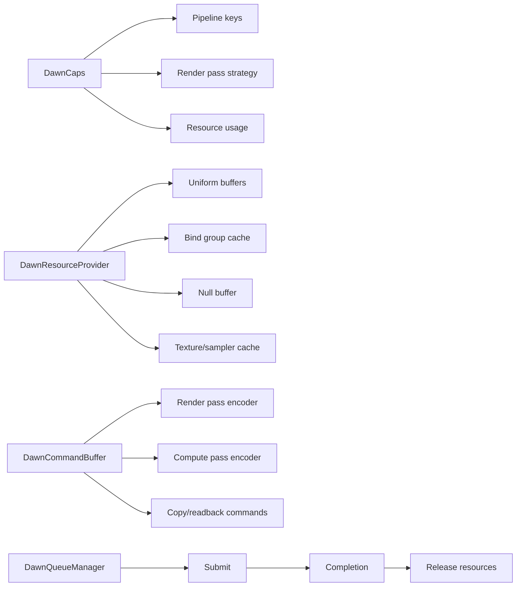
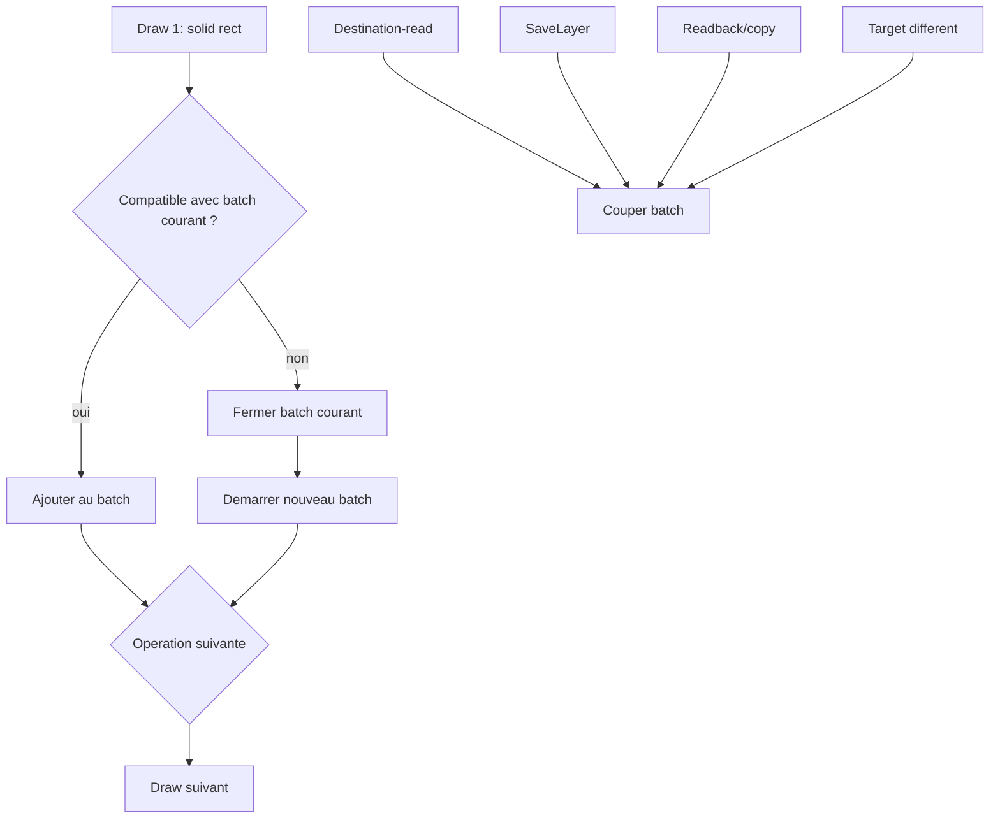
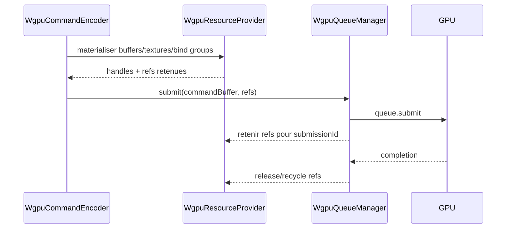
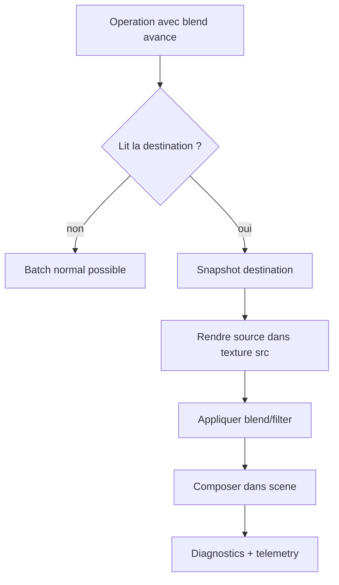
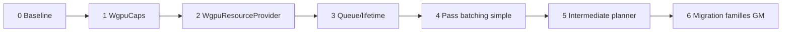
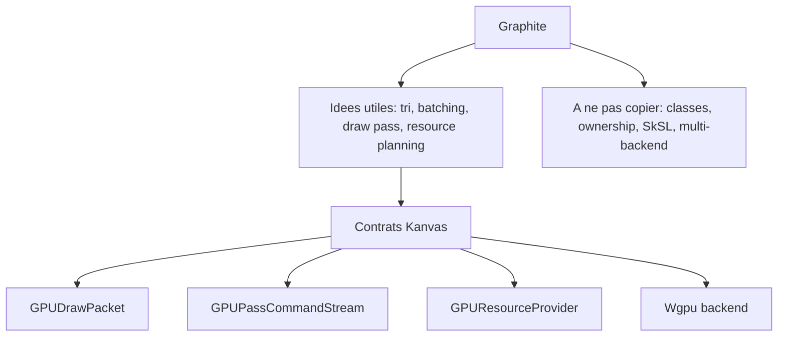

# Schemas Markdown

Ce fichier regroupe les schemas Mermaid et ASCII du rapport. Ils sont concus
pour etre lisibles dans un viewer Markdown compatible Mermaid.

## Flux actuel simplifie



Lecture : le chemin actuel est fonctionnel, mais beaucoup de decisions sont
prises pendant le dispatch concret. Cela limite le batching.

## Flux cible



Lecture : les decisions deviennent explicites avant l'encodage WGPU.

## Ce que Dawn apporte comme reference



Lecture : Kanvas peut reprendre ces responsabilites, mais avec ses propres
contrats et noms.

## Batching legal



Lecture : le batcher doit etre conservateur. Si une operation impose une
dependance forte, on coupe.

## Uniform slab

```text
GPUBuffer uniform slab

offset 0      offset 256    offset 512    offset 768
+------------+-------------+-------------+-------------+
| draw A     | draw B      | draw C      | libre       |
| uniforms   | uniforms    | uniforms    |             |
+------------+-------------+-------------+-------------+

Bind group layout stable
  binding 0 -> meme buffer
  draw A   -> dynamic offset 0
  draw B   -> dynamic offset 256
  draw C   -> dynamic offset 512
```

Lecture : plusieurs draws partagent le meme buffer, au lieu de creer un buffer
par draw.

## Resource lifetime par soumission



Lecture : la ressource vit jusqu'a completion GPU, pas seulement jusqu'a la fin
du bloc Kotlin qui l'a creee.

## Planner destination-read



Lecture : `scene`, `src` et `snap` deviennent un plan explicite.

## Roadmap



## Comparaison ASCII

```text
Aujourd'hui
----------
operation -> encoder -> ressources locales -> pass courte -> submit
operation -> encoder -> ressources locales -> pass courte -> submit
operation -> encoder -> ressources locales -> pass courte -> submit

Cible
-----
operations -> analyse -> batch compatible -> ressources provider -> pass longue -> submit
operations complexes -> planner intermediaire -> passes explicites -> submit
```

## Frontiere Graphite/Kanvas



Lecture : Graphite reste une reference algorithmique. Kanvas reste proprietaire
de ses objets.
