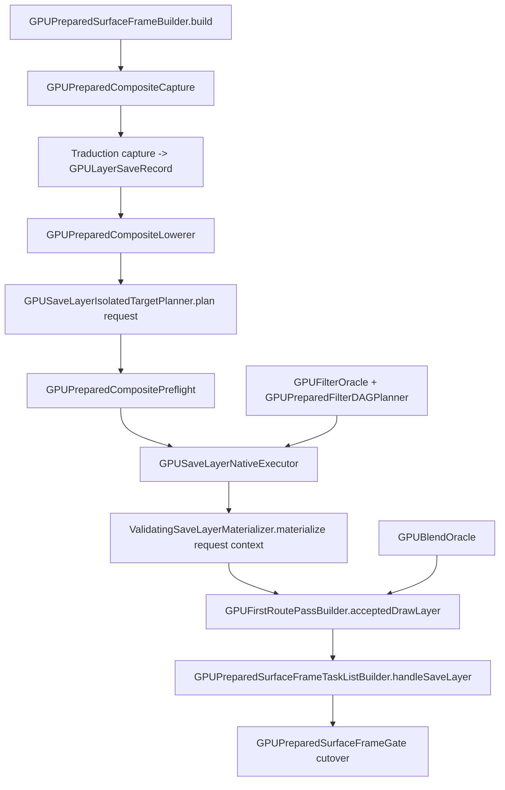

# Objectif & Portée

### Objectif

Migrer `DrawPicture`, `BeginLayer`, `EndLayer` vers la route de frame WebGPU préparée via une architecture **scratch-device-par-saveLayer**, avec planification DAG de filtres **native Kanvas** (non alignée sur `skif`), puis **basculer le frame gate** pour que ces ops quittent la route `Legacy`.

Cette version corrige le plan initial (`reports/fp07-composite-route-plan.md`) sur trois familles de défauts avérés par lecture du code : (1) contrats/API fictifs, (2) absence de l'étape d'intégration qui réalise la migration, (3) numérotation et File Map incohérents.

### En périmètre

- Lowering capture→plan de composite (`GPUPreparedCompositeLowerer`) branché sur les contrats **réels** (`GPUSaveLayerIsolatedTargetPlanner.plan(request)`).
- Promotion de l'oracle de blend CPU de test en production (`GPUBlendOracle`).
- Oracle CPU de filtres (`GPUFilterOracle`) : blur, color-filter, offset, crop (drop-shadow **implémenté+testé** ou **refusé explicitement**, jamais placeholder).
- Exécuteur natif saveLayer câblé sur `ValidatingSaveLayerMaterializer.materialize(request, context)` **réel**.
- Planner DAG de filtres, préflight de budget.
- Levée des refus capture : backdrop (`LAYER_DESTINATION_READ`, sémantique `LoadOp.Load`), mask-filter (`PAINT`), picture filter-source (`FilterPictureSource`).
- **Intégration frame-route** : `handleSaveLayer` dans `GPUPreparedSurfaceFrameTaskListBuilder` + cutover du `GPUPreparedSurfaceFrameGate`.

### Hors périmètre (non-goals à assumer)

- Pooling / réutilisation de textures + `approx-fit` (le vrai modèle de scalabilité Graphite) — différé à FP-09 ; on alloue aux dimensions **exactes**.
- Anti-aliasing des bords de layer (Graphite utilise `EdgeAAQuad` ; ici quad texturé single-sample) — gap de fidélité documenté.
- Runtime-effects WGSL dynamiques (FP-10).
- Découpage du monolithe `GPUPreparedSurfaceFrameTaskListBuilder` (4285 lignes) — noté en risque de dette.

# Contrats réels (Task 0)

### Relevé d'API à figer AVANT tout code (corrige les contrats fictifs du plan initial)

Les fondations du plan initial reposaient sur des signatures inventées qui ne compilent pas. Signatures **réelles** vérifiées dans `gpu-renderer/.../layers/LayerContracts.kt` :

#### Planner saveLayer (l.518)

```kotlin
fun plan(request: GPUSaveLayerIsolatedTargetRequest): GPUSaveLayerIsolatedTargetGatePlan
```

- `GPUSaveLayerIsolatedTargetRequest` (l.213) exige `saveRecord: GPULayerSaveRecord` (+ bounds, format, sampleCount, deviceGeneration, parentTargetLabel…). **Pas** de `scopeId/paint/transform/clip/childOperations`.
- Le refus se lit via `gatePlan.diagnostics.firstOrNull { it.terminal }?.code` — **il n'y a pas** de champ `.refused`.
- L'acceptation se lit via `gatePlan.layerPlan` (type `GPULayerPlan`, l.203 : `saveRecord`, `bounds`, …).

#### Materializer (l.461)

```kotlin
fun materialize(
    request: GPUSaveLayerMaterializationRequest,
    context: GPUTargetPreparationContext,   // 2e argument OBLIGATOIRE, absent du plan initial
): GPUSaveLayerMaterializationResult
```

- `GPUSaveLayerMaterializationRequest` (l.351-421) = ~20 champs requis + `init { require(...) }` : `targetId, gatePlan, parentPassId, childPassId, childTargetStateHash, parentTargetStateHash, childLoadStoreLabel, parentLoadStoreLabel, deviceGeneration, expectedTargetGeneration, actualTargetGeneration, availableUsageLabels, allocationAvailable, targetBudgetBytes, actualFormatClass, actualSampleCount, …`.
- `GPUSaveLayerMaterializationResult` (l.424) impose `require(!adapterBacked)` : l'exécuteur ne peut pas être adapter-backed.

#### Backdrop (déjà présent — réutiliser, ne pas recréer)

```kotlin
data class GPULayerBackdropPlan(val sourceLabel: String, val readBoundsLabel: String, ...) // l.98
```

#### Couche de traduction manquante

Le plan raisonnait au niveau « scope/paint/bounds bruts » ; les contrats réels travaillent au niveau `GPULayerSaveRecord + passId + hashes + générations + budget`. Une **couche de traduction capture→saveRecord→request** doit être conçue explicitement (elle est absente du plan initial).

#### Contrats vérifiés (Task 0 résolu)

```kotlin
// Toutes les signatures ci-dessus sont vérifiées sur la base FP-06 (40a873560)
// et la fondation fp-07 validée — voir reports/fp07-composite-route-plan.md, section Context.
```

# Design & Corrections

### Corrections apportées au plan initial

 # | Défaut du plan initial | Correction |
---|---|---|
 1 | Task 1 appelle `planner.plan(scopeId=…, …)` et lit `gatePlan.refused` | Réécrit sur `plan(request: GPUSaveLayerIsolatedTargetRequest)` + refus via `diagnostics.terminal.code` |
 2 | Task 5 : `materialize(request)` 1 arg + request inventée | 2 args `(request, context)` + `GPUSaveLayerMaterializationRequest` réel (~20 champs) |
 3 | Objectif « migrer » non tenu (aucune intégration frame-route) | Nouvelle phase : `handleSaveLayer` dans le task-list builder + cutover du frame gate |
 4 | `applyDropShadow` = `return source` placeholder marqué « done » | Drop-shadow implémenté+testé, ou refusé explicitement (guideline « pas de support sans évidence ») |
 5 | Numérotation dupliquée (deux Task 4/5/6) + File Map à références mortes | Renumérotation 1..N, File Map resynchronisé |
 6 | Pas de non-goals/risques | Section non-goals (pas de pooling/approx-fit, bords sans AA) |

### Architecture (inchangée sur le fond, câblage corrigé)



### Méthodologie

TDD strict par tâche (test rouge → implémentation minimale → vert → commit), comme le plan initial, mais **chaque squelette de code est aligné sur les contrats réels relevés en Task 0**. Le cutover du frame gate n'est activé qu'une fois **tous les tests des phases 1-3 verts** (résout l'incohérence 2B↔J/cutover du design).

# Delivery Steps

###   Step 1: Task 0 — Relevé et gel des contrats réels
Le plan documente les signatures exactes de tous les types présupposés, évitant tout code fictif.

- Relever et consigner dans le plan : `GPUSaveLayerIsolatedTargetRequest`/`…GatePlan` (+ extraction du refus via `diagnostics.terminal.code`, accès `layerPlan`).
- Relever `ValidatingSaveLayerMaterializer.materialize(request, context)`, les ~20 champs de `GPUSaveLayerMaterializationRequest` et le contrat `GPUSaveLayerMaterializationResult` (dont `require(!adapterBacked)`).
- Relever `GPUTargetPreparationContext`, `GPUPreparedCompositeLowering`, `GPUPreparedCompositeRefusalCodes`, `GPUPreparedFilterNormalization`, `GPUFilterNodeRoute`, `GPULayerBackdropPlan`.
- Concevoir la couche de traduction `capture → GPULayerSaveRecord → GPUSaveLayerIsolatedTargetRequest` (absente du plan initial).

###   Step 2: Phase 1 — Lowering + oracles (fondations)
Le lowerer produit un plan de composite depuis une capture, et les oracles CPU de blend et de filtres sont disponibles en production.

- `GPUPreparedCompositeLowerer.lower(capture)` : construit un `GPULayerSaveRecord` puis un `GPUSaveLayerIsolatedTargetRequest`, appelle `plan(request)`, lit le refus via `diagnostics` et l'acceptation via `layerPlan` (tests : frame vide, saveLayer simple, imbriqués, picture peinte, refus bounds invalides).
- Promotion de `GPUBlendCpuOracle` (test) → `GPUBlendOracle` (production, `public`), suppression du doublon et repointage des imports ; test paramétré sur tous les modes.
- `GPUFilterOracle` : blur (gaussien séparable), color-filter (matrice 4x5), offset, crop ; drop-shadow **implémenté avec test dédié** ou **refusé explicitement** (jamais `return source`).

###   Step 3: Phase 2 — Matérialisation native
Un saveLayer accepté est matérialisé en flux de commandes GPU via les contrats réels, avec planification DAG des filtres et préflight de budget.

- `GPUSaveLayerNativeExecutor` : construit un `GPUSaveLayerMaterializationRequest` complet (tous champs requis + `init`) et appelle `ValidatingSaveLayerMaterializer().materialize(request, context)` (2 arguments) ; garantit `adapterBacked=false`.
- Connexion de `GPUFirstRoutePassBuilder.acceptedDrawLayer()` dans `PassContracts.kt` (rôle `Composite`, commande `CompositeLayer` avec blend réel, pas de placeholder `parentTargetLabel=""`).
- `GPUPreparedFilterDAGPlanner.plan(normalization)` : routes par nœud (`NativeRender`/`FoldedMaterial`/`Refused`), textures intermédiaires, ordre d'exécution.
- `GPUPreparedCompositePreflight.preflight(plan, capabilities)` : refus stable si dépassement `maxTextureSize`/`maxColorAttachments` via `GPUPreparedCompositeRefusalCodes.PREFLIGHT`.

###   Step 4: Phase 3 — Levée des refus capture
Les captures backdrop, mask-filter et picture filter-source ne sont plus refusées et produisent des scopes exploitables.

- Backdrop : suppression du refus `LAYER_DESTINATION_READ` dans `GPUPreparedCompositeCapture.kt`, extraction du descripteur de backdrop, sémantique `LoadOp.Load` (backdrop initialise l'offscreen avant les enfants — conforme Skia), réutilisation du `GPULayerBackdropPlan` existant.
- Mask-filter : `GPUPreparedMaskFilterLowerer` (Blur → coverage A8, sinon refus `NATIVE_CAPABILITY`), suppression du refus `PAINT` pour maskFilter, rattachement du plan au draw capturé.
- Picture filter-source : création d'un scope `FilterPictureSource` dans `processPicture()` au lieu du refus `PAINT`.
- La frontière FP-06 `unsupported.picture.nested_vertices` (vertices dans un scope picture composite) reste refusée et est préservée — voir plan Task 3.

###   Step 5: Phase 4 — Intégration frame-route + cutover
DrawPicture/BeginLayer/EndLayer sont effectivement routés via la frame préparée, réalisant l'objectif de migration (absent du plan initial).

- Ajout de `handleSaveLayer` dans `GPUPreparedSurfaceFrameTaskListBuilder.kt` : branchement lowerer → préflight → executor → `GPUFirstRoutePassBuilder`, insertion des commandes `PrepareLayerTarget`/`RenderLayerChildren`/`CompositeLayer` dans l'ordonnancement.
- Cutover du `GPUPreparedSurfaceFrameGate.kt` / `GPULegacyImmediatePathAdapter.kt` : bascule de `DrawPicture/BeginLayer/EndLayer` de `Legacy`/`Composites` vers la route préparée.
- Le cutover n'est activé que sous condition « tous les tests des phases 1-3 verts » (résout l'incohérence de séquencement 2B↔J/cutover).
- Note de risque : ajout dans le monolithe de 4285 lignes sans découpage (dette assumée, extraction reportée).
